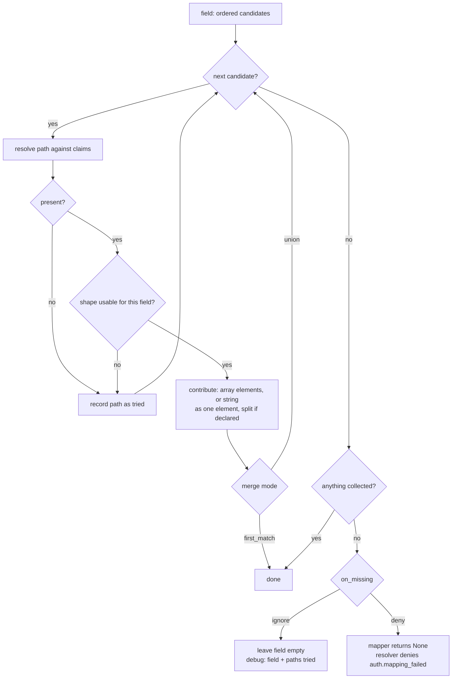
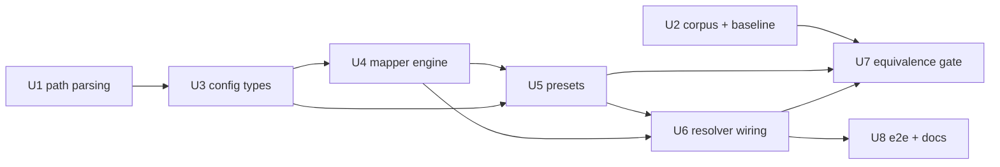

# feat: Configurable claim mapping for the JWT identity plugin

## Summary

Add a declarative claim map to `builtins/plugins/identity-jwt`: a path resolver with
backslash escaping, per-field ordered candidate lists with first-match or union merge,
and role sections for subject / client / workload. The OIDC standard shape moves out of
Rust and into an embedded JSON preset that drives the same engine, with the existing
`StandardClaimMap` retained as the equivalence oracle for a corpus-backed parity gate.
The corpus and the parity gate are written **first**, against the current Rust mapper,
so parity is measured from a baseline rather than asserted at the end.

---

## Implementation Guidelines

These apply to every unit below. They govern what ships in the repository, not what this
document says about it.

**1. No requirement or plan identifiers in durable text.** Nothing that ships may cite
`R7`, `U3`, `AE5`, or any other identifier from this plan or the origin document. That
covers rustdoc, code comments, commit messages, the CHANGELOG entry, test names, and the
pull-request description. These documents do not ship with the code and an identifier is
meaningless to a reader a year out. Describe the behavior or the constraint instead:

```
no    // Enforces R11: SPIFFE prefix on every candidate.
yes   // Prefix-check every candidate: a non-SPIFFE `sub` must not smuggle in an
      // arbitrary `spiffe_id` claim.
```

This is `CONTRIBUTING.md`'s rule, not a preference for this plan.

**2. Keep comments and rustdoc short.** One or two sentences per item is the target. State
what a reader needs in order to change the code safely, then stop.

- No em dashes. Use a comma, a colon, or a second sentence.
- No restating the signature in prose. `fn parse(s: &str) -> Result<ClaimPath, String>`
  does not need "Parses a string into a `ClaimPath`, returning an error on failure."
- No history, no progress notes, no internal milestone names. `CONTRIBUTING.md` has the
  full list and worked examples.
- Rationale earns its place when the code looks wrong without it. The `array_only` flag and
  the no-dedup choice are the two places in this work where a short "why" is worth writing.
- `missing_docs` and `missing_errors_doc` are denied workspace-wide, so every public item
  needs a doc line. Meeting the lint is not a reason to pad it.

The existing files in this crate run long on comments in places. Match the concise end of
what is there, not the verbose end.

**3. Commits.** Sign off every commit: `git commit -s`. No AI attribution trailers of any
kind. Keep the subject short and in the imperative, following the conventional-commit style
already in `git log`. A body only when the reason is not obvious from the diff, wrapped and
brief.

---

## Problem Frame

The mapping from validated JWT claims to typed identity fields is fixed in
`builtins/plugins/identity-jwt/src/claim_map.rs` (`StandardClaimMap`). The config hook
exists but leads nowhere: `resolver.rs` accepts `claim_mapper: "standard"` and rejects
every other name. An operator whose IdP nests roles (Keycloak `realm_access.roles`),
namespaces them behind a dotted URL (Auth0), or prefixes them with a colon (Cognito)
must write Rust and rebuild. See origin for the full framing and cost.

---

## Requirements

- R1. A field path addresses a value in the validated claim set by dot-separated segments, traversing nested objects, consuming only the claims the mapper already receives.
- R2. A backslash escapes a dot into a literal segment character; a doubled backslash is a literal backslash.
- R3. A colon is not a separator and needs no escaping.
- R4. A malformed path fails at construction, naming the field and the offending path — trailing escape, unrecognized escape, empty segment, empty path.
- R5. Each mappable field accepts a shorthand single path or an expanded form with an ordered candidate list.
- R6. Candidates resolve first-match by default; a field may declare that every resolving candidate contributes.
- R7. By default an array contributes its elements and a string contributes as one element; a field may declare that a delimited string is split.
- R8. A resolved value whose JSON shape cannot satisfy the field is ignored, not rejected.
- R9. A map covers subject, client, and workload; a resolver uses the section matching its configured role.
- R10. A map declaring no section for the resolver's role fails at construction.
- R11. Workload mapping enforces the SPIFFE prefix on every candidate and derives the trust domain from the identity URI when unmapped. Neither is configurable.
- R12. The required anchor per role continues to deny at runtime under today's denial code when no candidate resolves.
- R13. An absent mapper setting and the `standard` name produce identical identity output to today, across all three roles.
- R14. The standard shape is a preset and is what the default resolves to; the Rust standard mapper stays public.
- R15. An equivalence check compares the standard preset against the Rust standard mapper over a corpus spanning all three roles and every fallback the Rust mapper implements. Divergence fails the gate.
- R16. Presets ship for Keycloak, Auth0, and Cognito, written in the same surface an operator writes.
- R17. An unrecognized preset name fails at construction and lists the valid names.
- R18. The custom Rust mapper trait remains available with its public shape unchanged.
- R19. A field where no candidate resolved is distinguishable at runtime from a field that resolved to an empty collection. Both name the field; the former names every path tried.
- R20. A field may opt into denying when no candidate resolves. The default stays permissive.
- R21. A top-level claim consumed by a single-segment path is excluded from the claims bag; a nested path leaves its parent intact. Registered JWT claims are always excluded.
- R22. A map may override the inferred exclusion set, both to add and to re-include.

**Origin actors:** A1 (deployment operator), A2 (policy author), A3 (plugin integrator)

**Origin acceptance examples:** AE1 (R1, R5, R6), AE2 (R2), AE3 (R3), AE4 (R7), AE5 (R13, R15), AE6 (R19, R20), AE7 (R21), AE8 (R11), AE9 (R10), AE10 (R4)

---

## Success Criteria

Carried from origin, with one qualification:

- An operator running Keycloak, Auth0, or Cognito wires roles, permissions, and teams from
  configuration alone, with no Rust and no rebuild — including the nested and namespaced
  shapes that motivated the work. **Qualification, sharpened by the provider research:**
  two of the three motivating role shapes are per-deployment by construction and no preset
  can carry them. Auth0's roles must live under the deployment's own URL namespace, because
  Auth0 forbids a bare `roles` claim outright. Keycloak's per-client
  `resource_access.<client-id>.roles` embeds the operator's client id. Both are reachable by
  a hand-written map, which is the capability this work adds; neither is reachable by a
  preset. Each preset's `description` names what it omits, so the gap is visible rather than
  inferred from an empty roles set.
- A deployment that upgrades without touching its config sees identity output identical to
  today, and U7's gate is what proves it rather than review judgment.
- A policy author gating on typed identity fields no longer needs to know the IdP's claim
  layout, and a colon- or dot-containing claim name is reachable through the map even where
  the policy language cannot address it directly.
- A mistyped path is diagnosable from what the plugin emits, without reading source.

---

## Scope Boundaries

Carried from origin — none of these are built here:

- Array indexing and wildcard path segments.
- Value transforms: casing, prefixing, filtering, regex extraction.
- Mapping `ClientExtension.trust_level` or `WorkloadIdentity.attested_at`.
- Layering a preset with per-field overrides. An operator picks a preset or writes a map.
- A per-field expression language.
- Validating a map against a sample token as a config lint or CLI check.
- Any change to how claims flatten into the policy attribute bag downstream
  (`crates/ppe-apl-cmf/src/security.rs`, `payload::walk`).
- The header-projection and capability-gating half of the upstream thread.

### Deferred to Follow-Up Work

- **A public constructor that injects a custom `ClaimMapper`.** The trait is public and
  documented as injectable, but `JwtIdentityResolver::new` is the only constructor and
  it always builds the mapper itself. Adding an injection point is a separate API change
  (R18 only requires the trait's shape stay unchanged, which it does).
- **Deduplicating union results in `Vec`-typed client fields.** See Key Technical
  Decisions; the parity-preserving choice is no dedup, and dedup can be added later
  behind a field-level declaration if operators find duplicates noisy.
- **A Keycloak preset covering `resource_access.<client-id>.roles`.** The path embeds the
  operator's client id, so no shipped preset can fill it. The Keycloak preset covers
  realm roles; per-client roles need a hand-written map, which is exactly what this work
  makes possible. Documented in the preset's own description rather than silently absent.
- **Auth0 roles and teams in the shipped preset.** Auth0's restricted-claim list forbids
  `roles`, `groups`, `permissions`, and `entitlements` as bare custom-claim names, so roles
  can only arrive as a URL-namespaced claim under the deployment's own namespace, which no
  preset can know. Same shape of gap as Keycloak per-client roles, same answer: a
  hand-written map, which is the capability this work adds.
- **`IdentityPayload.raw_claims` is write-only.** The resolver populates it and the merge
  carries it, but no consumer reads it and it reaches no decision point. Either wire it up
  or remove it; either way it is pre-existing and not this work's to change.
- **A typed issuer surface.** `claims.include: [iss]` makes issuer gating possible, but the
  issuer is a property of token validation rather than a subject attribute, so
  `sec.subject.issuer` → `subject.issuer` would be the better home. Separate change,
  separate crate.
- **Keycloak Authorization Services permissions (`authorization.permissions`).** An array of
  objects whose `scopes` sit one level inside each element, so reaching them needs array
  indexing and wildcard segments, both out of scope above. Revisit if path indexing is
  ever added.

---

## Context & Research

### Relevant code and patterns

| Path | Why it matters |
|---|---|
| `builtins/plugins/identity-jwt/src/claim_map.rs` | `ClaimMapper` trait + `StandardClaimMap`. Stays as-is (R14, R18) and becomes the equivalence oracle. |
| `builtins/plugins/identity-jwt/src/resolver.rs:199-212` | The `claim_mapper` name match — the one place that rejects every name but `standard`. |
| `builtins/plugins/identity-jwt/src/resolver.rs:530-560` | Per-role dispatch into `map_subject` / `map_client` / `map_workload`, and the three `auth.mapping_failed` denials. |
| `builtins/plugins/identity-jwt/src/config.rs` | `JwtIdentityResolverConfig` and the `DecodingKeySource` → `build()` config-to-runtime pattern this work should mirror. |
| `crates/ppe-core/src/extensions/security.rs:31-60, 189-240, 253-293` | Destination field types. **`SubjectExtension.roles/permissions/teams` are `HashSet<String>`; the `ClientExtension` equivalents are `Vec<String>`.** This asymmetry decides the union ordering and dedup question. |
| `crates/ppe-apl-core/src/route.rs:327-333` | `get_dotted` — the existing dotted-path helper. In a crate `identity-jwt` does not depend on, with no escaping and no candidate semantics. Confirms origin's assumption: not reusable. |
| `crates/ppe-core/tests/wire_compatibility.rs:26` | The workspace's only `include_str!` fixture precedent, for the preset and corpus embedding decision. |
| `builtins/pdps/cedar-direct/tests/fixtures/` | Precedent for checked-in test fixtures in a builtin's own `tests/fixtures/`. |

### Provider claim shapes (researched 2026-08-20 against primary sources)

Grounded in Keycloak 26.7.2 upstream source plus its server-admin guide, Auth0's docs
(the markdown editions listed in `llms.txt`), the AWS Cognito Developer Guide PDF (the HTML
renders client-side and returns empty to a fetch), the SPIFFE JWT-SVID standard, and SPIRE's
`credtemplate/builder.go`. The findings that change preset content:

| Finding | Consequence |
|---|---|
| Keycloak `realm_access.roles` and `resource_access.<clientId>.roles` are **access-token only** (`idToken=false` on both mappers). | The Keycloak preset works on access tokens. A resolver pointed at an ID token gets empty roles, which the preset description must say. |
| Keycloak's `groups` claim (from the optional `microprofile-jwt` scope) **contains realm roles, not groups**. Real group paths need a hand-added `Group Membership` mapper whose claim name the admin types, so it has no default name. | The Keycloak preset must **not** map `groups` to `teams`. Doing so silently fills teams with roles. The highest-value trap in the research. |
| Auth0 maintains a restricted-claim list that silently drops non-namespaced custom claims. It includes `roles`, `groups`, `permissions`, and `entitlements`. Roles must arrive URL-namespaced, and the namespace is per deployment. | **No shipped Auth0 preset can carry a roles or teams path.** Auth0's preset covers `sub`, `azp`/`client_id`, `scope`, and the opt-in `permissions`. Roles are exactly the case a hand-written map exists for. |
| Auth0's `permissions` array is **doubly opt-in** (enable RBAC, then "Add Permissions in the Access Token"), and enabling it switches the token dialect. | Carried as a candidate ahead of `scope`, with the opt-in named in the description. |
| Auth0's default profile emits `azp`; the RFC 9068 profile emits `client_id`. Auth0 M2M `sub` is `<clientId>@clients`. | `client_id` candidates are `client_id`, `azp`. **`sub` is deliberately not a candidate**: stripping `@clients` is a value transform, out of scope, and the suffix is conditionally absent anyway. |
| Cognito has **no `azp`, ever**; the access token carries `client_id`. Cognito access tokens have **no `aud` by default**, and an M2M token can never have one (resource binding is user-flows-only). | The Cognito preset reads `client_id` only and does not lean on `aud`. |
| Cognito's `cognito:roles` and `cognito:preferred_role` hold **IAM role ARNs**, not application roles. `cognito:groups` holds group names and appears in **both** tokens. | Cognito preset maps `cognito:groups` to `teams` and maps nothing to `roles`, rather than filling roles with ARNs. |
| **None of the three IdPs mint a `client_name`.** | The field stays mappable for an operator with a custom claim; no preset ships a candidate for it. |
| Keycloak's `authorization.permissions` is an **array of objects** (`rsid`, `rsname`, `scopes`), only in an Authorization Services RPT. The published doc example (`resource_set_id`) is stale versus the serializer. | Unreachable without array indexing and wildcard segments, both out of scope. Not in the preset; recorded as follow-up. |
| `scope` is a space-delimited string in all three IdPs, never an array. | The `split: whitespace` decision is unanimous across providers, not an OAuth-era relic. |
| `aud` is shape-polymorphic *within* one IdP: Keycloak serializes a bare string at one audience and an array at two or more; Auth0 is a string for pure M2M and an array once `openid` is requested; SPIRE and Kubernetes always emit an array. | Confirms the bare-`aud` candidate must accept both shapes on one path, which is what the default (no `array_only`) does. |
| Keycloak's lightweight-access-token policy strips everything but `exp, iat, jti, iss, typ, azp, sid, scope, cnf` unless each mapper opts in. | A preset assuming `realm_access` produces an empty identity there. Named in the preset description; also the case `on_missing: deny` exists for. |
| SPIFFE JWT-SVID: `sub` **MUST** hold the SPIFFE ID. `iss` is not part of the spec and deriving trust from it is explicitly NOT RECOMMENDED. SPIRE's `aud` is invariantly an array; SPIRE's newer WIT-SVID has no `aud` at all. | Confirms deriving `trust_domain` from the URI authority rather than from `iss`. |
| Kubernetes projected ServiceAccount tokens carry **`kubernetes.io`** as a top-level claim name containing a dot, whose value is a nested object, with `sub` of the form `system:serviceaccount:<ns>:<sa>`. | The best real-world exercise of the escape rule: `kubernetes\.io.serviceaccount.name` needs an escaped dot *and then* traversal. Goes in the corpus and in U1's tests. |

Real claim names worth having in tests because they prove only `.` and `\` are special:
`cognito:groups`, `custom:department`, `allowed-origins`, `trusted-certs`, `cnf.x5t#S256`,
`https://my-app.example.com/roles`, `https://namespace.exampleco.com` (the whole URL is the
key, with no path segment), and an Auth0 `sub` containing `|`.

Deliberately **not** asserted anywhere, because the research could not verify them: what
Cognito puts in `sub` for a client-credentials token; whether Auth0 ever emits `permissions`
for a client-credentials grant; whether `cognito:groups` is omitted or emitted as `[]` for a
user in no groups. A preset or corpus entry that needed one of these would be a guess.

### `subject.claims` is the only route from a claim to a policy

Traced while resolving the claims-bag override question, and it changes that answer:

- `resolver.rs:609` sets `IdentityPayload.raw_claims` to the full claim map, and
  `payload.rs:274` merges it across resolvers, but **nothing reads it**. It reaches no PDP.
- The CMF namespace map (`crates/ppe-apl-cmf/src/security.rs:30-70`) has no issuer key, no
  `jti`, no `exp`. `sec.subject.claims` → `claim.<k>` and `sec.client.claims` →
  `client.claim.<k>` are the only claim-derived bag keys.

So every registered JWT claim is currently unreachable from policy. That matters because
this plugin accepts `trusted_issuers` as a **list**: a deployment wanting "only tokens from
the internal IdP may call this tool" cannot express it today. `claims.include: [iss]` is
what closes that, which is why `include` accepts registered claims.

Worth a follow-up, not fixed here: `raw_claims` is write-only. Either something should read
it or it should go, and the issuer arguably deserves a typed surface
(`sec.subject.issuer` → `subject.issuer`) rather than living in a subject-attribute bag.

### Repo constraints that shape the work

- `COVERAGE_FLOOR = 95` in the `Makefile`, enforced by `make coverage` in CI. Every new
  branch needs a test or the gate drops.
- `[workspace.lints]` denies `unwrap_used`, `expect_used`, `panic`, `indexing_slicing`,
  `missing_docs`, and `missing_errors_doc`. Path parsing and traversal must be written
  without indexing or unwrap in non-test code, and every public item needs rustdoc.
- The crate has **no YAML dependency**; `serde_json` is already a direct dependency.
- `CONTRIBUTING.md`: durable text carries no planning identifiers. **No `R7` / `U3` in
  commit messages, comments, rustdoc, changelog entries, or the PR description.**
- File headers: exactly the two SPDX/copyright lines, `#` for JSON-adjacent config
  formats where comments are possible. JSON preset and corpus files cannot carry the
  header — carry provenance as a data field instead (see U2, U5).
- No `docs/solutions/` in this repo, so there are no institutional learnings to carry.

---

## Key Technical Decisions

- **Presets are named through the existing `claim_mapper` field; an inline map is a new
  `claim_map` field; setting both is a config error.** R17 asks the unknown-name failure
  to match today's, which means the name lives where it lives today. A separate field for
  the inline map avoids an untagged `String | Map` enum, whose serde error ("data did not
  match any variant") is exactly the diagnostic R4 and R17 are trying to avoid.

- **Presets are JSON files under `src/presets/`, embedded with `include_str!`, listed in
  one table.** The crate can already parse JSON and cannot parse YAML; embedding removes
  runtime file I/O so a preset cannot go missing at deploy. The registry is a
  `&[(&str, &str)]` table so a single table-driven test covers every preset, and adding a
  preset without covering it is not possible. *(resolves origin's deferred question on
  preset embedding and gate validation)*

- **Union preserves order and does not deduplicate; the destination type decides.**
  `HashSet` fields dedup inherently. `Vec` fields keep candidate-declaration order, then
  in-array order within each candidate — fully deterministic, and byte-identical to today
  for the single-candidate standard case. Deduplicating `Vec` fields would change the
  output for a token carrying a repeated element inside one claim array, which R15 would
  score as divergence. Duplicates in `client.roles` are harmless to set-membership
  predicates. *(resolves origin's deferred question on union dedup and ordering)*

- **Splitting is field-level and whitespace-only, deserialized as an enum so a delimiter
  is additive.** Field-level is sufficient even where only one candidate needs it:
  splitting an array element that contains no whitespace is a no-op, so
  `permissions: [...]` and `scope: "a b"` can share one `split: whitespace` declaration.
  `split` parses from the string `whitespace`, which leaves room for a later
  `split: {on: ","}` map form without invalidating any authored config. *(resolves
  origin's deferred question on split vocabulary)*

- **A candidate may declare `array_only: true`, and the standard preset uses it.** This is
  the one knob origin did not name, and R13 forces it. Today `subject.roles` reads
  `claims.get("roles").and_then(Value::as_array)`: a string-valued `roles` yields nothing
  and, for `permissions` / `teams`, falls through to the next candidate. R7's default
  ("a string contributes as one element") would instead accept it, diverging on exactly
  the fallback chains R15 gates. `array_only` is a shape requirement, not a value
  transform, so it stays inside origin's scope boundary. The alternative — accept the
  divergence and exclude those shapes from the corpus — was rejected because it hides a
  behavior change behind a gap in the oracle.

- **A candidate whose value is present but unusable counts as not resolving, so the
  fallback chain continues.** This is what today does (`and_then(Value::as_array)` returns
  `None` and the `else if` runs) and it is what R8 means in a candidate list: ignore the
  shape, keep looking.

- **Claims-bag exclusion is computed from *declared* paths, not resolved ones.** Today's
  `RESERVED` lists are static: `azp` is excluded whether or not the token carries it, and
  `scope` is excluded even when `permissions` won. Inferring from declarations reproduces
  that exactly. Verified by hand against both `RESERVED` arrays — the standard preset's
  single-segment paths plus the registered JWT claims equal today's subject set
  (`sub, roles, permissions, scope, teams, groups` + registered) and today's client set
  (`client_id, azp, client_name, authorized_scopes, scope, aud, roles` + registered).

- **A strict-field miss returns `None` and denies under `auth.mapping_failed`; the field
  name reaches the operator through a log event, not the deny reason.** `ClaimMapper`
  returns `Option`, and R18 fixes its public shape, so there is no channel for a richer
  failure. R20 asks for a denial and R12 fixes the code; both are satisfied. The
  resolver's three deny reasons are reworded to stop naming `sub` / `client_id`
  specifically, since a configured map need not use those claims. Codes are unchanged and
  are what the tests pin (`tests/jwt_e2e.rs:335,366`).

- **Diagnostics are two distinct `debug!` events, emitted once per mapping call, with no
  rate limiting.** A no-candidate-resolved event names the field and every path tried; a
  resolved-but-empty event names the field only. Same level so one flag shows an operator
  both; distinct message and distinct structured fields so they are distinguishable. Misses
  are aggregated into one event per call rather than one per field, so a badly configured
  map costs one event per request, not N. No rate limiter: `debug` is off in production, so
  the hot-path cost is a level check, and a limiter would add state and suppress the very
  miss an operator turned the level up to see. *(resolves origin's deferred question on
  diagnostic levels and rate limiting)*

- **A preset ships a candidate only where the provider actually mints the claim.** Where a
  provider has no source for a field the preset declares nothing rather than guessing, and
  its `description` names what it omits and why. Three consequences fall out of the
  research: the Keycloak preset maps nothing to `teams`, because its `groups` claim holds
  realm roles; the Auth0 preset maps nothing to `roles` or `teams`, because Auth0 forbids
  those as bare claim names so they are per-deployment namespaced claims by construction;
  the Cognito preset maps nothing to `roles`, because `cognito:roles` holds IAM ARNs. A
  preset that quietly fills a field with the wrong concept is worse than one that leaves it
  empty, because the operator has no reason to look.

- **`client_id` candidates are `client_id`, `azp`, `clientId`, and never `sub`.** That covers
  Cognito (`client_id` only, no `azp` ever), Auth0's RFC 9068 profile (`client_id`), Auth0's
  default profile and Keycloak user flows (`azp`), and pre-2023 Keycloak's camelCase
  `clientId`. `sub` is excluded on purpose: Auth0's M2M `sub` is `<clientId>@clients` and
  stripping that suffix is a value transform this work does not do, while Keycloak's `sub` is
  a user UUID. Today's Rust mapper checks `client_id` then `azp`, so the `clientId` tail
  appears only in the Keycloak preset. **`standard` keeps exactly two candidates**, since it
  must stay byte-identical to the Rust mapper.

- **Config types compile into runtime types, mirroring `DecodingKeySource::build()`.**
  Serde structs hold authored strings; `compile()` parses every path once at construction
  and returns the error R4 requires. Nothing parses a path on the request path.

---

## High-Level Technical Design

> *This illustrates the intended approach and is directional guidance for review, not
> implementation specification. The implementing agent should treat it as context, not
> code to reproduce.*

### The config surface an operator writes

```yaml
plugins:
  - name: jwt-resolver
    kind: identity/jwt
    config:
      trusted_issuers: [...]
      role: user

      # Either a preset by name (existing field) ...
      claim_mapper: keycloak

      # ... or an inline map (new field). Both set is a config error.
      claim_map:
        subject:
          id: sub                                  # shorthand: one path
          roles:                                   # expanded: candidates + options
            paths:
              - realm_access.roles
              - resource_access.my-api.roles
            merge: union                           # first_match (default) | union
          permissions:
            paths:
              - { path: permissions, array_only: true }
              - scope
            split: whitespace
            on_missing: deny                       # ignore (default) | deny
          teams: ["https\\://my-app\\.example\\.com/teams", "groups"]
        client:
          client_id: [client_id, azp]
        workload:
          spiffe_id: [sub, spiffe_id]
        claims:
          exclude: [internal_debug]
          include: [scope]
```

### Path grammar

```
path      := segment ( '.' segment )*
segment   := ( literal | escape )+          # never empty
escape    := '\.'  -> '.'
           | '\\'  -> '\'
literal   := any char except '.' and '\'    # ':' and '/' are literals
```

Rejected at construction, naming the field and the path: empty path, empty segment
(`a..b`, `.a`, `a.`), trailing lone `\`, unrecognized escape (`\x`).

Note the YAML double-backslash: the escape is a single `\` in the JSON the plugin
receives, so a YAML double-quoted scalar needs `\\.` and a single-quoted or plain scalar
needs `\.`. Worth a rustdoc example in both quoting styles.

### Per-field resolution



### Shape handling matrix

| Resolved JSON | default candidate | `array_only: true` | with `split: whitespace` |
|---|---|---|---|
| `["a","b"]` | elements `a`, `b` | elements `a`, `b` | elements, each split |
| `"a b"` | one element `a b` | unusable → next candidate | `a`, `b` |
| `"a"` | one element `a` | unusable → next candidate | `a` |
| `42` / `true` | unusable → next candidate | unusable → next candidate | unusable → next candidate |
| `{...}` | unusable → next candidate | unusable → next candidate | unusable → next candidate |
| `["a", 42, {...}]` | `a`; non-strings skipped | same | same |
| absent | not resolved → next candidate | same | same |

Scalar destinations (`subject.id`, `client_id`, `client_name`, `spiffe_id`,
`trust_domain`) take the first candidate resolving to a string; `merge: union` on a scalar
field is a config error.

### Workload invariants (not configurable)

Every `spiffe_id` candidate is filtered by the `spiffe://` prefix *before* it counts as
resolving, so a non-SPIFFE `sub` is skipped and a later SPIFFE-shaped claim still wins —
matching `tests/jwt_e2e.rs:344-368`. `trust_domain` derives from the URI authority when
no candidate is declared for it.

---

## Output Structure

    builtins/plugins/identity-jwt/
      src/
        claim_map.rs              # unchanged: ClaimMapper trait + StandardClaimMap
        claim_path.rs             # NEW  path parsing, escaping, traversal
        claim_map_config.rs       # NEW  authored config types + compile()
        configured_mapper.rs      # NEW  ClaimMapper impl driven by a compiled map
        presets.rs                # NEW  registry table + lookup + unknown-name error
        presets/
          standard.json           # NEW  today's OIDC shape, as configuration
          keycloak.json           # NEW
          auth0.json              # NEW
          cognito.json            # NEW
      tests/
        fixtures/
          claim-corpus.json       # NEW  the equivalence corpus, a deliverable
        standard_preset_equivalence.rs   # NEW  the parity gate
        claim_map_e2e.rs          # NEW  operator-facing end-to-end

---

## Implementation Units

- U1. **Path parsing, escaping, and traversal**

**Goal:** A `ClaimPath` that parses an authored string into segments with backslash
escaping, and resolves it against a `&HashMap<String, Value>` claim set.

**Requirements:** R1, R2, R3, R4

**Dependencies:** None

**Files:**
- Create: `builtins/plugins/identity-jwt/src/claim_path.rs`
- Modify: `builtins/plugins/identity-jwt/src/lib.rs` (declare the module, re-export)

**Approach:**
- `ClaimPath::parse(&str) -> Result<ClaimPath, String>`; segments as `Vec<String>` since
  an escaped segment is not a borrow of the input.
- Single character-by-character pass. `:` and `/` are literals with no special handling.
- Resolution: first segment indexes the claim map, subsequent segments use
  `Value::get`, which already returns `None` when the path crosses a non-object (R1).
- Errors return the offending path and the reason; the caller prepends the field name
  (R4's "naming the field" is the caller's job because only it knows the field).
- `Display` renders the path back in authored form so a diagnostic can echo it.
- No indexing and no `unwrap` — the workspace denies both.

**Patterns to follow:** `crates/ppe-apl-core/src/route.rs:327-333` for the traversal
shape; `builtins/plugins/identity-jwt/src/config.rs` `build()` methods for
`Result<_, String>` errors the caller wraps into `PluginError::Config`.

**Test scenarios:**
- Happy path: `sub` resolves a top-level scalar; `realm_access.roles` resolves a nested array; a three-deep path resolves.
- Happy path: Covers AE3. `cognito:groups` parses as one segment and resolves verbatim.
- Happy path: Covers AE2. `https\://my-app\.example\.com/roles` parses to the single segment `https://my-app.example.com/roles` and resolves a claim of exactly that name. Use the verbatim name from Auth0's own docs, not an invented one.
- Happy path: `https\://namespace\.exampleco\.com` resolves a claim whose whole key is a URL with no path segment, which is a shape Auth0 documents.
- Happy path: `a\\b` parses to the single segment `a\b`.
- Happy path: `kubernetes\.io.serviceaccount.name` parses to three segments — `kubernetes.io`, `serviceaccount`, `name` — and resolves against a Kubernetes projected ServiceAccount token. An escaped dot followed by real traversal in one path, which is the rule's hardest case and a real claim shape rather than a constructed one.
- Happy path: literal characters that are not separators need no escaping and traverse normally: `cognito:groups`, `custom:department`, `allowed-origins`, `trusted-certs`, and `cnf.x5t#S256` (a `#` inside a traversed leaf segment).
- Edge case: a path whose first segment matches no claim resolves to `None`; a path crossing a scalar (`sub.x` where `sub` is a string) resolves to `None`; a path into an array (`roles.0`) resolves to `None`, since indexing is out of scope.
- Edge case: a claim whose value is `null` resolves to `Some(Value::Null)`, distinct from absent.
- Error path: Covers AE10. `roles\` (trailing lone escape) is rejected and the message contains the path.
- Error path: `roles\x` (unrecognized escape) is rejected and names the offending escape.
- Error path: `""`, `"a..b"`, `".a"`, `"a."` are each rejected as an empty path or empty segment.
- Error path: `Display` round-trips every accepted path so an escaped path echoes back as authored, not as its resolved text.

**Verification:** Every grammar case in the design section has a test; `make lint` passes
with no new allow attributes.

---

- U2. **The equivalence corpus and a characterization baseline for the Rust mapper**

**Goal:** Land the token corpus as a reviewable data artifact, with expected typed output
per entry, and a test proving the *current* `StandardClaimMap` produces exactly that.
This is the baseline the preset is later measured against.

**Requirements:** R15 (the corpus half), R13

**Dependencies:** None — deliberately before the engine exists.

**Execution note:** Characterization-first. Write the corpus and assert today's Rust
mapper against it *before* any of U3–U6 exists. A corpus written after the preset tends
to encode the preset's behavior rather than the mapper's.

**Files:**
- Create: `builtins/plugins/identity-jwt/tests/fixtures/claim-corpus.json`
- Create: `builtins/plugins/identity-jwt/tests/standard_preset_equivalence.rs`

**Approach:**
- Corpus is a JSON array of entries: `{ name, role, provenance, claims, expected }`.
  `provenance` is a data field, not a comment — JSON has no comments, and the SPDX header
  convention cannot apply to a `.json` fixture. It records where the shape came from
  (which IdP doc, or "constructed to exercise the `azp` fallback").
- `expected` mirrors the typed extension for that role, so an entry is readable as
  "this token in, that identity out" without running anything.
- Embedded with `include_str!`, following `crates/ppe-core/tests/wire_compatibility.rs:26`.
- Coverage obligation from R15: **every fallback the Rust mapper implements** needs an
  entry that exercises it, and an entry that exercises the *other* branch:
  `client_id`/`azp`; `authorized_scopes`/`scope`; `permissions`/`scope`; `teams`/`groups`;
  workload `sub`/`spiffe_id`; `aud` as string and as array.
- Deliberately included, because they are where the preset is most likely to diverge:
  a string-valued `roles`, a string-valued `teams`, a non-string element inside a role
  array, a non-string `aud`, an empty array, and a claim whose value is `null`.
- Realistic entries drawn from the researched provider shapes, each with its source in
  `provenance`: a Keycloak access token with `realm_access.roles`,
  `resource_access.<clientId>.roles`, `azp`, a space-delimited `scope`, and the
  hyphenated `allowed-origins`; a Keycloak service-account token carrying `client_id`,
  `clientHost`, `clientAddress`, and `preferred_username: service-account-<clientId>`; an
  Auth0 default-profile M2M token with `sub: <clientId>@clients`, bare-string `aud`, `azp`,
  and `gty: client-credentials`; an Auth0 user token with a namespaced
  `https://my-app.example.com/roles`; a Cognito ID token with `cognito:groups`,
  `cognito:username`, `cognito:roles` holding ARNs, and `identities` as an array of objects;
  a Cognito access token with `client_id`, a dotted-and-slashed `scope`
  (`resourceserver.1/appclient2`), and **no `aud`**; a SPIRE JWT-SVID with a SPIFFE `sub`,
  an array `aud`, and no `iss`; and a Kubernetes projected ServiceAccount token carrying
  `kubernetes.io` as a dotted top-level claim over a nested object.
- Shape coverage the research says the corpus must not miss: `aud` as a bare string **and**
  as an array on otherwise-identical tokens (Keycloak flips between them by audience count),
  and a token with no `aud` at all (Cognito's default access token).
- This unit's test asserts corpus `expected` against `StandardClaimMap`. U7 adds the
  preset side to the same file.

**Patterns to follow:** `crates/ppe-core/tests/wire_compatibility.rs` for the
`include_str!` fixture test; `builtins/plugins/identity-jwt/src/claim_map.rs` tests for
the claim-construction helper shape.

**Test scenarios:**
- Happy path: every corpus entry maps through the Rust mapper for its declared role and equals `expected`, field by field — id/anchor, roles, permissions, teams, scopes, audiences, and the full claims bag.
- Edge case: the corpus is non-empty and covers all three roles; the test fails if any role has zero entries, so a later edit cannot quietly drop a role.
- Edge case: every fallback pair listed above has at least one entry per branch; assert this structurally (by entry name) rather than trusting review.
- Edge case: `aud` present as a string, present as an array, and absent entirely each produce the audience list today's mapper produces.
- Error path: an entry whose `claims` lack the role's anchor declares `expected: null` and the mapper returns `None`.
- Integration: the corpus file parses and every entry deserializes — a malformed corpus fails the suite rather than silently skipping entries.

**Verification:** `cargo test -p praxis-policy-plugin-identity-jwt` passes against the
unmodified mapper, and deliberately perturbing one `expected` value fails the test.

---

- U3. **Authored claim-map config types and compilation**

**Goal:** The serde types an operator writes, and a `compile()` that parses every path and
validates the map, returning the construction-time errors R4 and R10 require.

**Requirements:** R4, R5, R6, R7, R10, R22

**Dependencies:** U1

**Files:**
- Create: `builtins/plugins/identity-jwt/src/claim_map_config.rs`
- Modify: `builtins/plugins/identity-jwt/src/lib.rs`

**Approach:**
- `ClaimMapConfig { subject: Option<RoleMap>, client: Option<RoleMap>, workload: Option<RoleMap>, claims: Option<ClaimsOverrides> }`.
- `RoleMap` is a map of field name → `FieldMap`, with `deny_unknown_fields` so a misspelled
  field name fails at construction instead of silently mapping nothing. Field names per
  role are fixed: subject `{id, roles, permissions, teams}`; client
  `{client_id, client_name, authorized_scopes, authorized_audiences, roles, permissions, teams}`;
  workload `{spiffe_id, trust_domain, client_id, selectors}`. `client.permissions` and
  `client.teams` are included even though the Rust mapper never fills them — they exist on
  the extension and no path can reach them today.
- `FieldMap` has a **hand-written `Deserialize`** that dispatches on the JSON value kind:
  string → one candidate; array → ordered candidates; object → the expanded form with
  `paths` required. An untagged enum would collapse all three into "data did not match any
  variant", which defeats R4's naming requirement.
- A candidate is a bare path string or `{ path, array_only }`.
- Expanded `FieldMap`: `paths`, `merge: first_match|union`, `split: whitespace`,
  `on_missing: ignore|deny`. `split` deserializes from the bare string `whitespace` via an
  enum, leaving room for a map form later.
- `compile()` returns `Result<CompiledClaimMap, String>`: parses every `ClaimPath`,
  prefixing the field name onto U1's error; rejects `merge: union` on a scalar-destination
  field; rejects an empty `paths` list.
- `CompiledClaimMap::role(&TokenRole)` returns the section or the R10 error naming the
  missing role.
- `ClaimsOverrides { exclude: Vec<String>, include: Vec<String> }` — plain claim names,
  not paths, since the bag is keyed by top-level claim name.

**Patterns to follow:** `builtins/plugins/identity-jwt/src/config.rs` — serde config type
plus `validate()`/`build()` returning `Result<_, String>`; `DecodingKeySource`'s
`#[serde(tag = "kind", rename_all = "snake_case")]` for the vocabulary style.

**Test scenarios:**
- Happy path: Covers AE1. All three field forms deserialize — `roles: sub`, `roles: [a, b]`, `roles: {paths: [a, b], merge: union}` — and compile to the same candidate order the author wrote.
- Happy path: a candidate written as `{path: permissions, array_only: true}` compiles with the flag set; a bare string compiles with it unset.
- Happy path: `split: whitespace`, `merge: union`, `on_missing: deny` each round-trip; omitted options take the documented defaults (`first_match`, no split, `ignore`).
- Happy path: `claims: {exclude: [...], include: [...]}` compiles, and an absent `claims` block compiles to no overrides.
- Edge case: a role section present but empty compiles (it declares the role, which is what R10 checks) — and the anchor still denies at runtime.
- Error path: Covers AE10. A malformed path inside `subject.roles` fails compilation and the message names both `subject.roles` and the offending path.
- Error path: Covers AE9. `CompiledClaimMap::role(Client)` on a subject-only map errors and the message names `client`.
- Error path: an unknown field name in a role section is rejected and names the field and the role.
- Error path: `merge: union` on `subject.id` is rejected as meaningless for a scalar.
- Error path: `paths: []` is rejected; `roles: {}` (no `paths`) is rejected naming `paths`.
- Error path: a `FieldMap` given a number or boolean is rejected with a message naming the field, not a serde variant dump.

**Verification:** Every construction-time rejection has a message naming the field, and
no rejection path produces serde's untagged-enum error text.

---

- U4. **The configured mapper: resolution engine, invariants, claims bag, diagnostics**

**Goal:** A `ConfiguredClaimMap` implementing `ClaimMapper` from a `CompiledClaimMap` —
candidate resolution, shape handling, merge, split, SPIFFE invariants, claims-bag
inference with overrides, and the two diagnostic events.

**Requirements:** R6, R7, R8, R9, R11, R12, R19, R20, R21, R22

**Dependencies:** U1, U3

**Files:**
- Create: `builtins/plugins/identity-jwt/src/configured_mapper.rs`
- Modify: `builtins/plugins/identity-jwt/src/lib.rs`

**Approach:**
- One resolution routine shared by all three roles: given a field's compiled candidates,
  produce an ordered `Vec<String>` plus the set of paths tried. Collection destinations
  absorb the vec (`HashSet` dedups; `Vec` keeps order and duplicates); scalar destinations
  take the first string.
- Shape handling follows the design section's matrix. A present-but-unusable value counts
  as not resolving so the chain continues (R8).
- Workload: the `spiffe://` prefix filter is applied inside candidate resolution for
  `spiffe_id`, so a non-SPIFFE candidate is skipped rather than accepted; `trust_domain`
  derives from the URI authority when the section declares no path for it (R11).
- Anchors (`subject.id`, `client.client_id`, `workload.spiffe_id`) returning nothing →
  `None` from `map_*`, which the resolver turns into `auth.mapping_failed` (R12).
- `on_missing: deny` on a non-anchor field also returns `None`, with a `warn!` naming the
  field, because the trait has no richer channel (R18).
- Claims bag: exclusion = registered JWT claims (`iss, aud, exp, nbf, iat, jti, sub`) ∪
  the first segment of every **single-segment** declared candidate path in this role's
  section, then `+ overrides.exclude`, then `- overrides.include` (R21, R22). Multi-segment
  paths contribute nothing, which is what leaves a nested parent visible (AE7).
  `include` accepts any claim name, registered ones included; a name appearing in both
  `exclude` and `include` is a construction error rather than a silent precedence rule.
  `WorkloadIdentity` has no claims field, so this applies to subject and client only.
- Diagnostics: aggregate all missed fields into one `debug!` per mapping call carrying
  field names and the paths tried; a separate `debug!` for fields that resolved to an
  empty collection, carrying field names only (R19).
- `attestor` stays hardcoded `"jwt"` and `attested_at` stays `None` — both out of scope.

**Patterns to follow:** `builtins/plugins/identity-jwt/src/claim_map.rs` `impl ClaimMapper
for StandardClaimMap` for the per-role method shape and the reserved-claim loop it
replaces.

**Test scenarios:**
- Happy path: Covers AE1. A Keycloak-shaped token with `realm_access.roles` and `resource_access.my-api.roles`, mapped with `merge: union`, yields the union of both; the same map with `first_match` yields only the first resolving source.
- Happy path: Covers AE4. `permissions` declared with `split: whitespace` turns `scope: "read write delete"` into three entries; without the declaration the same claim yields one entry `"read write delete"`.
- Happy path: Covers AE2, AE3. An escaped dotted namespaced claim and a `cognito:groups` claim each populate their field end-to-end through the mapper.
- Happy path: union order is candidate-declaration order then in-array order, asserted on a `Vec`-typed client field where order is observable; a value appearing in two candidates appears twice, which is the documented no-dedup decision.
- Edge case: Covers AE7. A nested role path leaves its parent claim whole in the claims bag; a single-segment path excludes its claim.
- Edge case: R21's inference reproduces today's reserved set — assert the claims bag for the standard preset's declarations equals the two `RESERVED` arrays, for both subject and client.
- Edge case: `claims.exclude` drops an otherwise-visible claim, and `claims.include` restores one the inference dropped.
- Edge case: `claims.include: [iss]` puts a registered JWT claim back in the bag — the case that makes issuer gating expressible. Assert it for `iss`, `jti`, and `exp`, since the rule is "any claim" with no allowlist.
- Error path: a claim named in both `exclude` and `include` fails at construction and the message names the claim.
- Edge case: a field resolving to `[]` yields an empty collection and the resolved-but-empty diagnostic, not the miss diagnostic.
- Edge case: a `Vec` destination and a `HashSet` destination given the same duplicate-bearing input differ as documented — set dedups, vec does not.
- Error path: Covers AE6. A mistyped path leaves the field empty, emits the miss diagnostic naming the field and every path tried, and is distinguishable from the empty-collection event; the same map with `on_missing: deny` returns `None` instead.
- Error path: R8 — a numeric `aud`, an object where a string list is expected, and a non-string element inside a role array are each ignored rather than failing the map.
- Error path: Covers AE8. A non-SPIFFE `sub` with a bogus `spiffe_id` produces no workload identity; a non-SPIFFE `sub` with a *valid* `spiffe://` in a later candidate still resolves, and the prefix filter has no config surface that can disable it.
- Error path: a missing anchor returns `None` for each of the three roles.
- Integration: `trust_domain` is derived from the SPIFFE URI when unmapped and taken from the declared path when mapped.

**Verification:** Behavior matches the shape matrix and the resolution flowchart for every
cell and branch; diagnostics are asserted by capturing `tracing` events, not by eyeballing
output.

---

- U5. **Preset registry and the four embedded presets**

**Goal:** `standard`, `keycloak`, `auth0`, and `cognito` presets as embedded JSON, a
registry table, and a lookup whose unknown-name error lists the valid names.

**Requirements:** R14, R16, R17

**Dependencies:** U3, U4

**Files:**
- Create: `builtins/plugins/identity-jwt/src/presets.rs`
- Create: `builtins/plugins/identity-jwt/src/presets/standard.json`
- Create: `builtins/plugins/identity-jwt/src/presets/keycloak.json`
- Create: `builtins/plugins/identity-jwt/src/presets/auth0.json`
- Create: `builtins/plugins/identity-jwt/src/presets/cognito.json`
- Modify: `builtins/plugins/identity-jwt/src/lib.rs`

**Approach:**
- `PRESETS: &[(&str, &str)]` with `include_str!`, sorted by name so the error text is
  deterministic. `lookup(name)` returns the parsed-and-compiled map or an error listing
  every valid name, matching the existing text shape at `resolver.rs:203-208`.
- The `standard` preset must reproduce the Rust mapper exactly. Per the array-only
  decision: `subject.roles`, `subject.teams`' both candidates, `client.roles`, and the
  first candidate of `subject.permissions` / `client.authorized_scopes` carry
  `array_only: true`; `scope` candidates carry `split: whitespace`;
  `client.authorized_audiences` reads a bare `aud` so both the string and array shapes are
  accepted.
- Provider presets follow the researched shapes in Context & Research, and each carries a
  `description` naming what it covers, what it omits, and which claims are opt-in at the
  IdP. Per the honesty decision above, a field with no genuine provider source gets no
  candidate.

  | Preset | subject.roles | subject.permissions | subject.teams | client anchor | Description must say |
  |---|---|---|---|---|---|
  | `keycloak` | `realm_access.roles` | `scope` (split) | **nothing** | `client_id`, `azp`, `clientId` | Access tokens only (`realm_access` is `idToken=false`); per-client roles need a hand-written map; `groups` is *not* mapped because it holds realm roles; a lightweight-access-token policy strips `realm_access` entirely. |
  | `auth0` | **nothing** | `permissions` (array-only), then `scope` (split) | **nothing** | `client_id`, `azp` | Roles and teams are per-deployment namespaced claims and cannot be presettable; `permissions` requires both RBAC and "Add Permissions in the Access Token"; `sub` is not a client-id candidate because of the `@clients` suffix. |
  | `cognito` | **nothing** | `scope` (split) | `cognito:groups` | `client_id` only | No `azp` exists; access tokens have no `aud` unless resource binding was requested and never for M2M; `cognito:roles` holds IAM ARNs and is deliberately not mapped to roles. |

- A preset declares a role section wherever the provider has a real shape for that role.
  None of the three has a workload shape, so none declares a workload section — an operator
  wiring `role: workload` uses `standard` or a hand-written map, and the R10 construction
  error is the correct outcome rather than a section full of guesses.
- `standard` is the only preset with a workload section, and it keeps today's two candidates
  (`sub` then `spiffe_id`, both prefix-filtered).
- No SPDX header on the `.json` files (JSON has no comment syntax); provenance and
  description live in data fields.

**Patterns to follow:** `crates/ppe-core/tests/wire_compatibility.rs:26` for `include_str!`;
`resolver.rs:199-212` for the unknown-name error text.

**Test scenarios:**
- Happy path: table-driven — every entry in `PRESETS` parses, compiles, and declares at least one role section. Adding a preset without a test is impossible because the test iterates the table.
- Happy path: each preset's declared paths all parse (implied by compile, asserted explicitly so a failure names the preset).
- Happy path: the `standard` preset compiles to the candidate order the Rust mapper checks in, asserted per field.
- Happy path: the Keycloak preset resolves realm roles from a Keycloak access token and its client anchor from `azp`; Auth0's resolves `permissions` and its anchor from `azp`; Cognito's resolves `cognito:groups` into teams and its anchor from `client_id`.
- Edge case: the honesty rule holds — the Keycloak preset leaves `teams` empty for a token carrying `groups`; the Auth0 preset leaves `roles` empty for a token carrying a namespaced roles claim; the Cognito preset leaves `roles` empty for a token carrying `cognito:roles`. Each is asserted, because an accidental candidate added later would otherwise pass silently.
- Edge case: no provider preset declares a workload section, so `role: workload` against one fails at construction naming the role.
- Edge case: `PRESETS` names are unique and sorted, so the R17 error text is stable.
- Error path: `lookup("made-up")` errors and the message lists every valid name.
- Error path: a preset with a deliberately broken path fails the table test rather than shipping (verified by temporarily perturbing one, not by a permanent fixture).

**Verification:** `make test` fails if any shipped preset is malformed; the unknown-name
message lists all four names.

---

- U6. **Resolver and plugin-config wiring**

**Goal:** Route `claim_mapper` through the preset registry, accept the new `claim_map`
field, reject setting both, enforce the role-section requirement at construction, and keep
the default identical to today.

**Requirements:** R9, R10, R12, R13, R17

**Dependencies:** U3, U4, U5

**Files:**
- Modify: `builtins/plugins/identity-jwt/src/config.rs` (add `claim_map`, document the
  preset names on `claim_mapper`)
- Modify: `builtins/plugins/identity-jwt/src/resolver.rs` (replace the name match at
  199-212; reword the three deny reasons at 530-560)
- Modify: `builtins/plugins/identity-jwt/src/lib.rs` (re-exports)

**Approach:**
- Resolution order at construction: both fields set → config error naming both; `claim_map`
  set → compile it; `claim_mapper` set → preset lookup; neither → the `standard` preset.
- After building the map, require the section matching `typed.role` (R10) so a
  misconfigured pairing fails at load rather than denying every request.
- The resolver keeps holding `Arc<dyn ClaimMapper>`; `ConfiguredClaimMap` is just another
  implementor, so `resolver.rs`'s dispatch at 530-560 is untouched apart from wording.
- Reword the three `auth.mapping_failed` reasons to stop naming `sub` / `client_id` /
  `spiffe://` as though they were fixed, and to point at the debug diagnostics. Codes are
  unchanged — `tests/jwt_e2e.rs:335,366` pin those.
- `StandardClaimMap` stays exported and untouched (R14, R18); after this unit nothing in
  the crate constructs it outside tests, which is the intended end state.

**Patterns to follow:** the existing `PluginError::Config` message convention in
`resolver.rs::new` — every message leads with `plugin '{name}'
(praxis-policy-plugin-identity-jwt)`.

**Test scenarios:**
- Happy path: R13 — a config with no `claim_mapper` and no `claim_map` builds, and `claim_mapper: "standard"` builds; both produce the same identity for the same token, for all three roles.
- Happy path: `claim_mapper: "keycloak"` builds where it previously failed.
- Happy path: an inline `claim_map` builds and is used in preference to nothing else being set.
- Edge case: `role: client` with a client-declaring preset builds; the same preset with `role: workload` fails if it declares no workload section, and the message names the role.
- Error path: Covers AE9. `claim_map` declaring only `subject` with `role: client` fails at construction naming `client`.
- Error path: Covers AE10. A malformed path in an inline `claim_map` fails at construction naming the field and path.
- Error path: `claim_mapper` and `claim_map` both set fails, and the message names both fields and says to pick one.
- Error path: R17 — `claim_mapper: "made-up-mapper"` fails and lists the valid names; the existing test at `resolver.rs:848` is updated to the new list rather than deleted.
- Error path: an unparseable `claim_map` (wrong JSON shape) fails at construction, not at first request.
- Integration: the factory (`factory.rs`) propagates each of the above as `PluginError::Config`, so a bad map is a startup failure and not a resolver that denies everything.

**Verification:** Existing `tests/jwt_e2e.rs` and `tests/jwks_url_e2e.rs` pass unchanged
except for any deliberate message rewording; a deployment config that sets neither field
behaves as before.

---

- U7. **The equivalence gate**

**Goal:** Close R15 — the standard preset and the Rust standard mapper produce identical
typed fields and identical claims bags across the whole corpus, and divergence fails CI.

**Requirements:** R13, R15

**Dependencies:** U2, U5, U6

**Files:**
- Modify: `builtins/plugins/identity-jwt/tests/standard_preset_equivalence.rs`
- Modify: `builtins/plugins/identity-jwt/tests/fixtures/claim-corpus.json` (only if the
  gate reveals a fallback the corpus does not reach)

**Approach:**
- For each corpus entry, map through both `StandardClaimMap` and the compiled `standard`
  preset for the entry's role, and assert equality field by field — including the full
  claims bag, not just the typed collections. A whole-struct comparison plus per-field
  assertions on failure, so a diff names the field rather than dumping two structs.
- Assert `None`-vs-`Some` agreement too: an entry the Rust mapper declines must be declined
  by the preset.
- Set membership alone is not enough for the `Vec`-typed client fields — compare order as
  well, since the no-dedup / declaration-order decision is only observable there.
- If the gate finds divergence, the resolution is to change the **preset**, never the Rust
  mapper (R14, R18) and never the corpus, unless the corpus entry is itself wrong about
  what the IdP mints.

**Test scenarios:**
- Happy path: Covers AE5. Every corpus entry produces identical output from both paths, across all three roles.
- Happy path: every fallback branch the corpus enumerates is asserted through both paths, so a fallback the preset expresses differently cannot pass on the strength of the other branch.
- Edge case: the claims bag comparison is exhaustive — same key set and same `Value` per key, so a claim the preset fails to exclude fails the gate.
- Edge case: `Vec`-typed client fields are compared for order, not just membership.
- Error path: deliberately perturbing one preset candidate (locally, not committed) fails the gate — confirms the gate has teeth rather than passing vacuously.
- Error path: a corpus entry the Rust mapper declines is also declined by the preset.

**Verification:** `make test` fails on any divergence; the gate runs in the standard CI
test job with no extra wiring.

---

- U8. **Operator-facing end-to-end coverage and documentation**

**Goal:** Prove the acceptance examples through the real resolver with real tokens, and
document the surface for the operator who has to author it.

**Requirements:** R16, R19, R20, plus end-to-end confirmation of AE1–AE4 and AE6–AE10

**Dependencies:** U6

**Files:**
- Create: `builtins/plugins/identity-jwt/tests/claim_map_e2e.rs`
- Modify: `builtins/plugins/identity-jwt/src/claim_map_config.rs` (rustdoc: the authored
  surface, with both YAML quoting styles for the escape)
- Modify: `builtins/plugins/identity-jwt/src/lib.rs` (crate-level docs mention the map)
- Modify: `builtins/plugins/identity-jwt/src/factory.rs` (the header comment shows the
  operator YAML; extend it with a `claim_map` example)
- Modify: `CHANGELOG.md` (an `### Added` entry under `[Unreleased]`)
- Modify: `README.md` (only if it advertises the JWT plugin's config surface)

**Approach:**
- Reuse the existing e2e harness: `mint_jwt`, `resolver_plugin_config_for`, `invoke_with`
  from `tests/jwt_e2e.rs`. Copy or lift the helpers rather than making `jwt_e2e.rs` a
  module of the new file — integration test binaries do not share code, and the existing
  file's helpers are private to it.
- Each e2e test wires a plugin config containing a `claim_map`, mints a matching token, and
  asserts the resulting `SubjectExtension` / `ClientExtension` / `WorkloadIdentity`.
- Rustdoc carries the escaping trap explicitly: the plugin receives JSON, so a YAML
  double-quoted scalar needs `\\.` and a plain or single-quoted scalar needs `\.`. Both
  forms shown, since getting this wrong is the most likely operator error.
- CHANGELOG entry describes the behavior in operator terms and **cites no requirement
  identifiers**, per `CONTRIBUTING.md`.

**Patterns to follow:** `builtins/plugins/identity-jwt/tests/jwt_e2e.rs` for the whole e2e
shape; the `[Unreleased] / ### Added` bullet style in `CHANGELOG.md` — one bold lead
sentence, then the consequence, then the PR link.

**Test scenarios:**
- Happy path: Covers AE1. A Keycloak token through a union map yields the union of realm and per-client roles in `subject.roles`.
- Happy path: Covers AE2. An Auth0 token carrying `https://my-app.example.com/roles` (Auth0's own documented claim name), mapped with the escaped path, populates `subject.roles`; the same path unescaped resolves nothing, proving the escape is what does the work.
- Happy path: Covers AE3. A Cognito token populates `subject.teams` from `cognito:groups`.
- Happy path: Covers AE4. A space-separated permissions string splits when declared and stays whole when not.
- Happy path: `claim_mapper: keycloak` (preset by name) works end-to-end, not only as a unit-level lookup.
- Happy path: a map declaring `claims: {include: [iss]}` produces a subject whose claims bag carries `iss`, so a multi-issuer deployment can gate on which IdP minted the token. This is a new capability, and the CHANGELOG entry should say so.
- Edge case: Covers AE7. A policy-visible claims bag still contains the whole `realm_access` object after a nested path consumed `realm_access.roles`.
- Error path: Covers AE6. A mistyped role path yields a permitted request with empty roles; the same map with `on_missing: deny` yields `auth.mapping_failed`.
- Error path: Covers AE8. The workload role rejects a non-SPIFFE subject even when a SPIFFE-shaped claim sits elsewhere and the map points at both, and accepts when a valid SPIFFE candidate resolves.
- Error path: Covers AE9, AE10. A role-mismatched map and a malformed path each fail at plugin construction through the factory, before any request.
- Integration: the raw token still lands in `RawCredentialsExtension.inbound_tokens` under the configured role, and `raw_claims` still carries the full claim set — the map changes what is typed, not what is stashed.

**Verification:** Every acceptance example in the origin document has an end-to-end test;
`make lint`, `make test`, and `make coverage` pass at the existing floor.

---

## Unit Dependency Graph



U1 and U2 are independent and can land in either order or in parallel. U2 before U4 is the
point of the sequencing: the baseline exists before anything can be tuned to fit it.

---

## System-Wide Impact

- **Interaction graph:** `JwtIdentityFactory::create` → `JwtIdentityResolver::new` is the
  only construction path, so every new failure mode surfaces as a startup
  `PluginError::Config`. `crates/ppe/src/lib.rs:110,162` re-exports the factory behind the
  `jwt` feature; no facade change is needed because no new public type crosses that
  boundary.
- **Error propagation:** construction errors are `PluginError::Config`; runtime denials stay
  `auth.mapping_failed` with today's code (R12). Nothing new can panic on the request path —
  paths are parsed once at construction.
- **State lifecycle risks:** the compiled map is immutable and shared behind the existing
  `Arc<dyn ClaimMapper>`. No new interior mutability, no new background task, nothing added
  to the `Drop` path.
- **API surface parity:** `ClaimMapper` and `StandardClaimMap` keep their exact public shape
  (R14, R18). `JwtIdentityResolverConfig` gains one optional field, so every existing config
  still deserializes. `claim_mapper`'s accepted value set widens, which is additive.
- **Integration coverage:** the claims-bag rule is only observable downstream, through
  `crates/ppe-apl-cmf/src/security.rs` flattening `subject.claims` into `claim.*`. AE7's
  guarantee — a policy reading `claim.realm_access.roles` keeps working — is asserted at the
  extension boundary in U4/U8; the flattening itself is out of scope and unchanged.
- **Unchanged invariants:** the SPIFFE prefix check has no config surface; `attestor` stays
  `"jwt"`; `TokenKind::SpiffeJwt` selection, the `inbound_tokens` stash, and `raw_claims`
  pass-through are untouched; the three denial codes are unchanged.

---

## Risks & Dependencies

| Risk | Mitigation |
|---|---|
| The preset diverges from the Rust mapper on a shape nobody thought to test, and R13's compatibility promise is quietly false. | U2 lands the corpus and the baseline *before* the engine exists, the corpus deliberately includes the shapes most likely to diverge (string-valued collection claims, non-string elements, empty arrays, `null`), and U7 asserts the corpus structurally covers both branches of every fallback. |
| `array_only` is a knob origin did not name, so a reviewer reads it as scope creep. | Recorded as a Key Technical Decision with the concrete divergence it prevents and the rejected alternative. It is a shape requirement, not a value transform. |
| Union on `Vec`-typed client fields produces visible duplicates and operators read it as a bug. | Documented in rustdoc and the CHANGELOG as the deliberate no-dedup behavior; dedup is listed as follow-up work rather than smuggled in against R15. |
| Operators get the YAML escaping wrong (`\.` vs `\\.` depending on quoting style) and see silent misses. | Both forms in rustdoc; the miss diagnostic names every path tried; `on_missing: deny` exists precisely so a mistyped path can be made loud. |
| Presets encode claim shapes an IdP does not actually mint, or that require an opt-in protocol mapper the operator has not enabled. | Presets follow the researched shapes in Context & Research; each carries a `description` naming what it covers, what it omits, and which claims are opt-in; the corpus records provenance per entry; U5 asserts the deliberate omissions so a later "helpful" addition cannot slip in silently. |
| A preset fills a field with the wrong concept and the operator has no reason to look — Keycloak `groups` into teams (it holds realm roles), Cognito `cognito:roles` into roles (it holds IAM ARNs). | Both are named as omissions in the preset table and pinned by a test asserting the field stays empty. This is the failure mode the research was commissioned to find, and it is the one a reviewer cannot catch by reading the preset. |
| The new code is branch-dense (path parsing, shape matrix, merge modes) and drags line coverage below the 95 floor. | Test scenarios are enumerated per unit to cover each branch, and `make coverage` runs before the PR per `CONTRIBUTING.md`. |
| Requirement identifiers leak from this document into commits, comments, or the PR body. | `CONTRIBUTING.md` forbids it; called out in Documentation Notes so it is checked at PR time. |

---

## Open Questions

### Resolved during planning

- **Split vocabulary (origin: affects R7):** whitespace-only, deserialized from the bare
  string `whitespace` via an enum, so a later `split: {on: ","}` map form is additive.
  Field-level rather than per-candidate, which is sufficient because splitting a
  whitespace-free array element is a no-op.
- **Union dedup and ordering (origin: affects R6):** no dedup at the engine level; the
  destination type decides. Order is candidate-declaration order, then in-array order.
  Driven by `SubjectExtension` using `HashSet` and `ClientExtension` using `Vec`.
- **Preset embedding and gate validation (origin: affects R14, R16):** JSON under
  `src/presets/`, `include_str!`, one `&[(&str, &str)]` registry table, one table-driven
  test. The crate has no YAML dependency and already has `serde_json`.
- **Diagnostic level and rate limiting (origin: affects R19):** two distinct `debug!`
  events, aggregated to one per mapping call, no rate limiting.
- **Corpus and preset sourcing (origin: affects R15, R16):** grounded in provider
  documentation, with provenance recorded per corpus entry and a `description` per preset.
  No live IdP access required, and no fixture claims to be a capture of real traffic.
- **Whether `client.permissions` and `client.teams` earn their place in the surface:** yes,
  as mappable fields; no, as preset content. The research confirms none of the three
  providers mints a source for either (Auth0 and Cognito have no client-role concept at all,
  and Keycloak routes service-account roles through `realm_access`). They stay mappable so an
  operator with a custom claim can reach fields that are otherwise unreachable, and no preset
  declares a candidate for them.
- **How a strict-field miss denies without changing the trait:** return `None`, deny under
  `auth.mapping_failed`, name the field in a log event. R18 forbids widening the trait's
  public shape.
- **Whether the claims-bag exclusion is inferred from declared or resolved paths:**
  declared. Verified by hand against both `RESERVED` arrays that this reproduces today's
  behavior exactly.

- **Whether `claims.include` can re-include a registered JWT claim:** yes, any claim.
  `include` overrides the inference for any name the operator lists, registered or not.
  R21's "always" describes the inference; R22 is the override for the inference. The
  deciding fact is that `subject.claims` is the *only* route from a JWT claim to a policy
  (see Context & Research), so reading R21 as binding over R22 would leave `iss`
  permanently unreachable with no alternative in this release. The footgun — a policy
  re-checking `exp` with different leeway than the engine used — is accepted, because it
  already exists for any `claim.<k>` an IdP happens to mint.
- **Precedence when a claim appears in both `exclude` and `include`:** construction error
  naming the claim. There is no coherent intent to honour, and silently picking a winner
  would hide a config mistake.
- **Config vocabulary:** `paths`, `merge` (`first_match` | `union`), `split`
  (`whitespace`), `on_missing` (`ignore` | `deny`), and `array_only` on a candidate. `paths`
  names the field's content; `merge` is the ordinary word for combining candidate results
  and has room for further modes; `on_missing` reads as a policy for an event and could
  later gain `warn`; `array_only` states a constraint as a fact. Settled here rather than at
  authoring time because the surface is cheap to choose now and expensive to change once
  operators have written configs against it.
- **Whether the reworded deny reasons need test updates:** no. Verified across the whole
  workspace — the only assertions are on the code (`tests/jwt_e2e.rs:335,366`), and the
  `claim_map.rs` doc comments reference `auth.mapping_failed` by code too. Nothing asserts
  on reason text.
- **Corpus file layout:** one file. Roughly 20 to 25 entries at ~15 lines each lands near
  350 lines, which reviews fine, and one file keeps both the all-three-roles check and the
  `include_str!` trivial. Splitting later is a mechanical refactor with no design content,
  so it does not need to be a plan decision.

### Deferred to implementation

Nothing. Every question this plan opened is answered above; what remains genuinely unknown
is recorded as follow-up work in Scope Boundaries rather than as an open question here.

---

## Documentation / Operational Notes

- `CHANGELOG.md` gets one `### Added` entry under `[Unreleased]`, in the established style:
  a bold lead sentence, the operator-visible consequence, and the PR link. It must state
  that an existing config is unaffected, since that is the question an upgrading operator
  has. Two things are worth their own mention: which presets ship and what each deliberately
  omits, and that `claims.include` can surface a registered claim such as `iss`, which makes
  gating on the issuing IdP expressible for the first time.
- **No requirement or plan identifiers in the commit messages, code comments, rustdoc,
  CHANGELOG entry, or PR description** — `CONTRIBUTING.md`. Describe the behavior. See
  Implementation Guidelines for this and the comment-length and commit rules.
- Each source file carries exactly the two-line SPDX header. The `.json` preset and corpus
  files cannot (JSON has no comments); provenance and description live in data fields.
- No new dependency, no new feature flag, no migration, and no rollout gate. The default
  path is byte-identical to today, which is what U7 proves.
- `make lint && make test && make coverage` before the PR; `make coverage` is the one that
  catches the branch-dense new code.

---

## Sources & References

- **Origin document:** [docs/brainstorms/2026-08-20-configurable-claim-mapping-requirements.md](docs/brainstorms/2026-08-20-configurable-claim-mapping-requirements.md)
- Upstream issue: [praxis-proxy/policy#27](https://github.com/praxis-proxy/policy/issues/27)
- Prerequisite, merged: [preserve JSON shape in subject claims (#9)](https://github.com/praxis-proxy/policy/pull/9) — `d0f0536`
- Code: `builtins/plugins/identity-jwt/src/claim_map.rs`, `src/config.rs`, `src/resolver.rs`, `src/factory.rs`
- Destination types: `crates/ppe-core/src/extensions/security.rs`
- Non-reusable prior helper: `crates/ppe-apl-core/src/route.rs` (`get_dotted`)
- Downstream flattening, unchanged: `crates/ppe-apl-cmf/src/security.rs`
- Repo conventions: `CONTRIBUTING.md`, `Cargo.toml` (`[workspace.lints]`), `Makefile` (`COVERAGE_FLOOR`)

### Provider primary sources (consulted 2026-08-20)

Keycloak 26.7.2:
- `services/src/main/java/org/keycloak/protocol/oidc/OIDCLoginProtocolFactory.java` — the built-in client scopes and which are default vs optional, and the `realm_access.roles` / `resource_access.${client_id}.roles` mapper definitions with `idToken=false`
- `services/src/main/java/org/keycloak/services/managers/ClientManager.java` — `addServiceAccountProtocolMappersViaScope`
- `core/src/main/java/org/keycloak/json/StringOrArraySerializer.java` — why `aud` flips between string and array
- <https://www.keycloak.org/docs/latest/server_admin/index.html> — client scopes, protocol mappers, audience support, lightweight access tokens
- <https://www.keycloak.org/docs/latest/upgrading/index.html> — the 26.1.0 `service_account` client scope

Auth0:
- <https://auth0.com/docs/secure/tokens/access-tokens/access-token-profiles> — the Auth0 vs RFC 9068 dialects, and which carries `azp` vs `client_id`
- <https://auth0.com/docs/secure/tokens/json-web-tokens/create-custom-claims> — the restricted-claim list that forbids a bare `roles` claim, and the namespacing rules
- <https://auth0.com/docs/get-started/apis/enable-role-based-access-control-for-apis> — the two toggles `permissions` needs
- <https://auth0.com/docs/manage-users/organizations/using-tokens> — the M2M access-token sample with `sub: <clientId>@clients`
- <https://auth0.com/docs/manage-users/access-control/sample-use-cases-actions-with-authorization> — the canonical namespaced-roles recipe

AWS Cognito:
- <https://docs.aws.amazon.com/pdfs/cognito/latest/developerguide/cognito-dg.pdf> — used because the HTML guide renders client-side and returns an empty document to a fetch
- <https://docs.aws.amazon.com/cognito/latest/developerguide/amazon-cognito-user-pools-using-the-id-token.html> and `...-the-access-token.html` — the default payloads
- <https://docs.aws.amazon.com/cognito/latest/developerguide/scopes-m2m-and-resource-servers.html> — resource binding, and why an M2M token can never carry `aud`

SPIFFE and Kubernetes:
- <https://github.com/spiffe/spiffe/blob/main/standards/JWT-SVID.md> — `sub` MUST hold the SPIFFE ID; `iss` is not part of the spec
- `spiffe/spire`, `pkg/server/credtemplate/builder.go` — what SPIRE actually mints, including the invariant array `aud`
- <https://datatracker.ietf.org/doc/html/draft-schwenkschuster-oauth-spiffe-client-auth> — why `iss`-based trust-domain derivation is NOT RECOMMENDED
- <https://kubernetes.io/docs/reference/access-authn-authz/authentication/#service-account-tokens> — the projected-token shape carrying `kubernetes.io`
