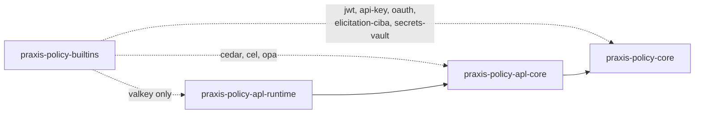

# refactor(builtins): consolidate bundled extensions into one published crate

## Summary

Collapse the nine separately-published `builtins/**` crates into a single `praxis-policy-builtins` crate at `crates/builtins`, one Cargo feature per implementation, and retire the top-level `builtins/` directory. The facade's feature names, `install_builtins` behavior, re-export paths, and policy `kind` strings stay byte-identical; the work is packaging, workspace wiring, lint-gate coverage, release tooling, and docs.

---

## Problem Frame

Nine builtin crates are versioned, packaged, and published independently, but the facade already presents them to hosts as granular features. Each new builtin adds another publish unit without adding host-facing value. `crates/ppe/Cargo.toml` already records this reasoning as the justification for keeping `http-hyper` out of its own crate.

The saving is worth stating precisely, because the plan's risk budget should be weighed against the real benefit: the publishable set drops from 15 packages to 7, and each publish invocation performs its own verify build — Cedar, regorus, and the Redis/TLS stack being the expensive ones. The release surface that must stay mutually consistent shrinks by the same factor. The crates.io new-crate rate limit (a burst of five, then one per ten minutes) is not the binding constraint at this size. Consolidation makes the publish count independent of the builtin count.

---

## Requirements

- R1. All nine builtin implementations, their tests, and their packaged assets live in `crates/builtins` (package `praxis-policy-builtins`), with factories and types reachable through clear public module paths.
- R2. One Cargo feature per implementation, so selective compilation survives — in particular Valkey's Redis/TLS stack must stay opt-in.
- R3. The top-level `builtins/` directory is retired.
- R4. Nine workspace dependencies collapse to one; `members`, `default-members`, and `[workspace.dependencies]` are updated.
- R5. The facade's `jwt`, `api-key`, `oauth`, `elicitation-ciba`, `cedar`, `cel`, `opa`, `valkey`, `secrets-vault`, and `builtins` features are preserved, along with `install_builtins`, its re-exports, its registration behavior, and all policy `kind` strings.
- R6. Downstream in-repo consumers are rewired: `crates/ppe-pdp-diff`, `crates/ppe-benches`, facade tests, and doctests.
- R7. `tools/publish.sh` publishes one builtin package instead of nine, with its publishable-workspace guard, dependency ordering, and idempotent rerun behavior all still correct.
- R8. `.github/workflows/release.yaml` packaging and publish steps, and `make publish-dry`, remain correct under the new package set.
- R9. Maintained documentation no longer references the old crate names or `builtins/`-prefixed paths, and carries migration guidance for consumers depending on an old builtin crate directly.
- R10. Verification covers the facade under default, representative individual, and all-builtin feature sets; affected tests; `cargo package --workspace --locked`; and a release dry run showing exactly one builtin package and none of the old nine.
- R12. Engine-crate rustdoc and comments no longer name a retired crate. Distinct from R6: these are upstream crates carrying stale prose, not downstream consumers being rewired.
- R11. The blocking quality gates keep covering the moved code. Because the consolidated crate is `default = []`, clippy, rustdoc, MSRV, and release packaging must gain an all-features pass or they silently stop seeing nine crates' worth of source.

---

## Scope Boundaries

- `reference/plugins/pii-scanner` and `reference/plugins/audit-logger` stay where they are and stay unpublished. They are deliberately not builtins and serve as out-of-tree plugin examples.
- The admission test for future work, stated because consolidation removes the per-manifest "why this is not a builtin" note that currently documents the boundary: a bundled integration the facade exposes as a feature and the maintainers commit to publishing and supporting is a builtin; anything else is a reference plugin. This sentence lands in `docs/content/crates.md` in U8 so contributors read it where they look.
- No facade feature name, `install_builtins` signature, re-export path, or policy `kind` string changes.
- The `ppe-*` engine crates (`ppe-core`, `ppe-apl-core`, `ppe-apl-cmf`, `ppe-apl-runtime`, `ppe-orchestration`) are not consolidated.
- No behavioral change to what any builtin does. This is a packaging refactor.
- Published history of the retired names is neither yanked nor altered. Note that only seven of the nine have any: `praxis-policy-plugin-identity-api-key` and `praxis-policy-secrets-vault` have never been published (both landed after the v0.3.1 tag), verified against the registry. They are abandoned before first publish rather than retired.
- No transitional shim crates are published. That exclusion also forecloses a dual-publish release carrying both the consolidated crate and the old nine, since the code cannot live in two places without shims. Recorded here so it is not re-litigated on release day. This plan also declines the other available de-risking move, a prerelease test publish, for the reasons under Release approach.
- Pre-existing red state is not chased as part of this work: the tests already failing at `main`, the stale `praxis` binary, and the `taplo fmt --check` failures in `make lint-extra`.

### Deferred to Follow-Up Work

- The byte-identical duplication between `docs/safety-invariants.md` and `docs/dev/safety-invariants.md`. Both are edited here because both carry a `builtins/` path, but merging them is separate work.
- Promoting `sha2` and `base64` into `[workspace.dependencies]` beyond what collapsing the nine manifests requires naturally. (`zeroize` is already a workspace dependency; three builtins declare it literally with byte-identical values, so that collapse is a no-op rather than a promotion.)

---

## Context & Research

### Relevant Code and Patterns

- `crates/ppe/src/lib.rs` is the closest in-repo analogue and the pattern to mirror: nine features fanning out to nine `#[cfg(feature = ...)]` re-export blocks, a `_builtin` private marker feature, a `register_builtins!` macro with per-feature gated arms, and incremental factory-vector builders carrying `#[allow(unused_mut, clippy::vec_init_then_push)]`.
- `crates/ppe/Cargo.toml` sets `[package.metadata.docs.rs] all-features = true` with a comment stating that without it a `default = []` build renders nothing. The consolidated crate inherits that exact hazard.
- `crates/ppe-core/src/lib.rs` shows the cleanest module-level feature gating, and its `src/` is nine `mod.rs` module directories — the precedent for the group layout here.
- `builtins/plugins/identity-api-key/tests/api_key/main.rs` is the directory-harness pattern for tests: one linked binary with `mod` submodules and a crate-level `#![allow(...)]` carrying a `reason`.
- `builtins/plugins/delegator-oauth/src/cache/mod.rs` is the precedent for nested modules inside a builtin.
- `tools/publish.sh` derives its guard from `cargo metadata --no-deps`, comparing a sorted `ORDER` against every package whose `publish` field is not `[]`.

### Institutional Learnings

- There is no `docs/solutions/` corpus in this repo. The operative learnings come from `AGENTS.md`, `CONTRIBUTING.md`, and prior session experience:
  - Newly linked test binaries cost roughly 87s each under macOS Endpoint Security. The nine crates carry 18 `tests/*.rs` targets today, so harness count is a real cost lever.
  - `make check` is the inner loop and is the one gate that already runs both a default and an `--all-features` pass.
  - Scoped runs use `cargo nextest run -p <crate>`; full workspace runs are reserved for commit boundaries.
  - An identity-route alarm test is intermittently red (about 1 in 10), which makes `make coverage` intermittently red. Establish a baseline before attributing a failure to this work.
  - `taplo fmt --check` in `make lint-extra` already fails on roughly ten TOML files at `main`; that target is not part of `make ci`.
- `CONTRIBUTING.md` forbids history in comments, naming "This used to be a separate crate" as an explicit do-not-write. Migration narrative belongs in `CHANGELOG.md` and `docs/`, never in the merged crate's source.
- Durable text carries no planning identifiers: no `U3`/`R7`-style references in commits, rustdoc, changelog, or PR bodies.

### Constraints Discovered During Research

All verified directly against the tree.

- **Module and symbol collisions make nesting mandatory.** `config` appears in six crates; `factory` in eight; `error`, `resolver`, `cache`, `decision`, `store` in two to five each. `BuildError` is defined four times, `OnError` twice, `CacheConfig` twice, `ClientSecretSource` twice, and `KIND` in eight or more places (api-key alone has three: `identity/api-key`, `file`, `http`).
- **No intra-builtin dependencies exist.** Consolidation cannot introduce a cycle.
- **Three distinct upstream anchors:** `praxis-policy-core` (five crates), `praxis-policy-apl-core` (three PDPs), `praxis-policy-apl-runtime` (Valkey only). Manifest comments state explicitly that the three PDPs stay `apl-core`-only at compile time so they can be used standalone.
- **None of the nine crates defines a single Cargo feature today, and none declares a single `optional` dependency.** Every feature and every `optional` marker in the merged crate is new. A merge that keeps third-party deps non-optional would build Cedar, regorus, and the Redis/TLS stack under `default = []`, defeating R2 outright.
- **Cargo forbids optional dev-dependencies.** This has a wider reach than Valkey: the three PDPs take `praxis-policy-apl-runtime` and `praxis-policy-core` as dev-dependencies (deliberately, for their visitor integration tests), and five crates take `praxis-policy-core` with `test-util`. All of these become *unconditional dev-dependencies* of the merged crate, alongside `testcontainers` and its Docker/TLS stack. The consumer-facing property survives because dev edges are not transitive, but every in-repo assertion about them must constrain itself to normal edges.
- **The blocking gates run default features only.** `make lint` is `clippy --workspace --all-targets -- -D warnings`, `make doc` is `cargo doc --workspace --no-deps`, `.github/workflows/msrv.yaml` is `cargo check --workspace --all-targets`, and release verify plus `make publish-dry` are `cargo package --workspace --locked`. None passes `--all-features`. Only `make check` has a second all-features pass. Under `default = []` the merged crate contributes only its cedar, cel, and opa modules to those gates — the three `ppe-pdp-diff` pulls in by default — and nothing from the other six implementations.
- **`unexpected_cfgs` is denied with `check-cfg`, but it covers only one failure class.** It turns a `cfg(feature = "...")` naming a nonexistent feature into a build error. It does **not** flag a missing arm in an `any(feature = ...)` predicate — a feature omitted from a group gate produces no diagnostic; the module is simply never declared and the registration is silently absent.
- **No gate in this repo ever builds a partial feature set.** `make check` and `make test` run default then `--all-features`. A feature body that forgets its own `dep:` edge compiles under `--all-features` (another feature supplies it) and compiles nothing under default features. The entire failure class this refactor introduces sits in the one region no gate covers.
- **`register_builtins!` cannot take a module path.** Its matcher is `$( feature $feat:literal => $krate:ident :: $factory:ident ),*` and its body uses `$krate::KIND` and `$krate::$factory` separately. An `ident` fragment cannot hold `praxis_policy_builtins::plugins::identity_jwt`, and `$krate:path` is not substitutable because a `path` fragment may not be followed by `::`.
- **`crates/ppe-pdp-diff` and `crates/ppe-benches` hold non-optional `{ workspace = true }` dependencies on all three PDP crates.** Deleting those `[workspace.dependencies]` entries without rewiring both manifests in the same commit makes `cargo metadata` fail workspace-wide, breaking `make check`, `make lint`, and `make test` — not just those two crates. The facade is dragged in too, since it takes `praxis-policy-pdp-diff` as a dev-dependency.
- **The move carries a substantial path rewrite:** 55 `pub(crate)` sites and 71 `crate::`-rooted references across the nine crates, the largest cluster being 17 uses of `crate::config`. Every one becomes module-relative. The compiler catches these, so it is a sizing fact rather than a correctness risk.
- **One fixture reader is manifest-dir-relative:** `builtins/pdps/cedar-direct/tests/resolver_config.rs` resolves `tests/fixtures/` through `env!("CARGO_MANIFEST_DIR")`. All other assets use path-relative `include_str!` and survive the move untouched.
- **`tools/publish.sh` is already broken at `main`:** `ORDER` lists 14 names against 15 publishable packages (`praxis-policy-plugin-identity-api-key` is absent), so its guard fails and the script cannot run to completion today. `praxis-policy-secrets-vault` *is* in `ORDER` correctly — the guard compares against workspace members, not the registry.
- **The guard compares sorted sets, so it proves membership only.** After consolidation the sequence itself is load-bearing (the consolidated crate must follow `apl-runtime`; the facade must be last) and entirely unchecked.
- **`cargo metadata --no-deps` is not name-ordered.** Today `packages[0]` is `praxis-policy`, but `orchestration` precedes `core` and `ppe-benches` sorts last. `tag-matches-manifest` and the publish script's version derivation are correct only because `shared-version` holds across every member, not because of ordering.
- **Old crate names are load-bearing strings, not comments:** `builtins/plugins/identity-jwt/src/resolver.rs` embeds `praxis-policy-plugin-identity-jwt` in eight operator-facing messages and asserts on it at line 1579; `builtins/plugins/delegator-oauth/src/delegator.rs` has seven such sites; `builtins/plugins/elicitation-ciba/src/approver.rs:541` has one.
- **`make docs-lint` exits 0 when `npx` is absent**, printing "docs-lint skipped". "The target passes" is not an observable outcome.
- **The nine manifests carry roughly 200 lines of load-bearing dependency rationale**, much of it security-relevant: `jsonwebtoken`'s `aws_lc_rs` choice justified against RUSTSEC-2023-0071, regorus's four excluded default features, `cel`'s pinning, `moka`'s coalescing guarantees, the `hmac`/`sha2` lockstep, `stacker`'s musl stack story, and the curated Redis/TLS feature sets.
- **`missing_docs` is denied workspace-wide**, so every new `pub mod` needs a doc comment.
- **Coverage is workspace-aggregate**, gated at 96% with no headroom, via `cargo llvm-cov --workspace --all-features --exclude ppe-benches` with `--include-ignored` and `VALKEY_TESTS_OPTIONAL=1`.
- `secrets-vault` is the one facade feature that deliberately does **not** imply `_builtin`, because Vault needs a host-supplied `HttpTransport` and is not auto-registered by `install_builtins`.
- Resolver 3 changes nothing material here. The relevant behavior is inherited from resolver 2: dev-dependency features stay out of the normal build, which is exactly what confines the dev-dependency concern above to test builds.

---

## Key Technical Decisions

- **Public module paths mirror the retired crate boundaries** (`plugins::*`, `pdps::*`, `session::*`, `secrets::*`), not a flat namespace: the collision inventory makes flattening unworkable. This keeps each facade `pub use` edit to a one-line path swap — but explicitly **not** the `register_builtins!` macro, which needs its own treatment below.
- **The three engine crates and the heavy or security-relevant third-party crates are `optional = true`; the shared runtime crates are not.** This is the mechanism that replaces Valkey's `default-members` exclusion, and it needs to be exactly this wide and no wider. `default = []` plus an optional `apl-runtime` edge does not gate `redis`; only marking `redis`, `deadpool-redis`, and `url` optional does, and the same holds for `cedar-policy`/`stacker`, `regorus`, `cel`, `jsonwebtoken`, `moka`, `hmac`, `getrandom`, `sha2`, and `base64`.

  But gating the shared runtime crates would be motion without effect. Every feature enables one engine crate, and `praxis-policy-core` already pulls `tokio`, `serde`, `serde_json`, `serde_yaml`, `async-trait`, `bytes`, `thiserror`, `tracing`, `arc-swap`, `chrono`, and `zeroize` unconditionally, so no consumer's resolved graph shrinks by making them optional here. Gating them anyway would roughly triple the hand-maintained `dep:` edge count in precisely the region the plan identifies as having no gate coverage, which is trading a real risk for no benefit. Leave them non-optional.

  One wrinkle to watch: the `cel` feature and the `cel` crate share a name, so that feature body must name `dep:cel` explicitly.
- **Private marker features on two axes**, following the facade's `_builtin` precedent. Upstream-dep markers (`_engine-core`, `_engine-apl-core`, `_engine-apl-runtime`) single-source each engine edge rather than restating it in five feature bodies. Group markers (`_plugins`, `_pdps`, `_session`, `_secrets`) collapse each module-group gate to one predicate instead of a multi-arm `any(...)` where a forgotten arm is silent. The group markers also give the shared crate-name const used by the operator-facing messages a correct gate, which an unconditional const could not have under denied `dead_code`.
- **Feature names on the consolidated crate match the facade's exactly**, so each facade body is a mechanical forward and a future rename is a lockstep two-file edit rather than a translation table. The consolidated crate also gets one umbrella feature enabling all nine, which `ppe-pdp-diff`, `ppe-benches`, and docs.rs all want. It gets no `_builtin` counterpart: registration stays in the facade.
- **`register_builtins!` keeps its `$krate:ident` matcher, fed by per-feature module aliases in the facade.** The matcher cannot accept a four-segment path and cannot be switched to `$krate:path`. Aliasing preserves the documented anti-drift property that the registration is keyed off the builtin's own `KIND` const; a two-path matcher variant would let the const and the factory drift apart.
- **Previously-public items stay public at their new paths.** The retired crates' `pub mod config`/`factory`/`error` were public API of published crates, and the facade re-exports only named factory types and aliased `KIND` consts. Keeping them public is what makes U8's migration story ("switch to the consolidated crate plus a feature") honest; the cost is a larger semver surface and a `missing_docs` obligation on each. The alternative — making everything the facade does not re-export crate-private — would strand direct consumers with no migration path, which contradicts R9.
- **`pub(crate)` widening is narrowed for credential-bearing modules and accepted everywhere else.** After consolidation `pub(crate)` means "visible to all nine implementations" rather than "visible within one builtin", and nothing enforces the retired boundary. Narrowing all 55 sites is a large mechanical edit for mostly little gain, but the sites that hold raw secret material are different in kind: Vault token and secret accessors, JWT signing-key holders, OAuth client-secret sources, API-key values, and the zeroize-wrapped types. Today the compiler makes it impossible for the OPA or CEL code to name a Vault or JWT internal; after consolidation it becomes legal and silent. Those modules get `pub(in ...)` scoping during the unit that moves them; the remaining sites stay widened.
- **The consolidated crate sets `[package.metadata.docs.rs] all-features = true`**, mirroring the facade. With `default = []` and every module behind a feature, docs.rs would otherwise publish an empty page for the crate that consumers are being pointed at, and the facade's plain `pub use` re-exports would resolve into it. Fixing it after the fact costs another version.
- **`make lint`, `make doc`, the MSRV job, and release packaging gain an all-features pass.** Without this, moving the code takes 18k lines out of the roughly 180 denied clippy lints and out of the rustdoc gate that the nine crates were inside. This is a prerequisite for every later unit's verification to mean anything, not a cleanup.
- **A durable per-feature check target** (`--no-default-features`, then each feature alone) lands in the Makefile **and gets its own CI job**. Grouped invocations cannot catch a feature that omits its own `dep:` edge or its group-marker implication, and no existing gate builds a partial feature set. Wiring it into `make ci` alone would accomplish nothing: nothing in `.github/` or `.hooks/` invokes `make ci` — `ci.yml` runs `make lint`, `make test`, and `make doc` as three separate jobs, and the pre-commit hook runs `make lint` — so `make ci` is a local convenience, not the gate.
- **Test harnesses are declared as explicit `[[test]]` targets with `required-features`.** Auto-discovered `tests/*.rs` roots cannot carry `required-features`, so every gated harness would link as an empty binary under default features — 87s each, for nothing, which would undercut the very cost argument for collapsing 18 targets.
- **Accept unconditional Valkey dev-dependencies.** Cargo rejects `optional` in `[dev-dependencies]`, so `testcontainers` and the `redis` dev surface compile whenever the merged crate's tests are built. The exposure is narrow — `make check` and `make test` already use `--workspace` and therefore already build Valkey today — so the honest choice is to accept it and measure. If measurement shows a material regression, the escape hatch is a small unpublished test-only workspace crate depending on `praxis-policy-builtins` with the `valkey` feature; deliberately not built now.
- **Operator-facing error strings adopt `praxis-policy-builtins`.** Keeping `praxis-policy-plugin-identity-jwt` in a message would name a crate that future releases do not publish. This is an intentional, operator-visible string change, and the assertion at `identity-jwt/src/resolver.rs:1579` moves with it.
- **Test targets collapse from 18 into exactly eight directory harnesses — one per implementation that has tests** (jwt, api_key, oauth, ciba, cedar, cel, opa, valkey; Vault has none), each declaring a single-feature `required-features`. The granularity is forced rather than chosen: `required-features` is all-or-nothing, so a harness gated on four plugin features would be skipped entirely under `--features jwt`, and the per-unit scenarios asserting that a unit's tests pass under its own feature would silently run zero cases. Declared in the U1 scaffold, not improvised by whichever move unit lands first.
- **The move uses `git mv`** so per-file history survives the relocation.
- **No consolidation narrative in source comments.** `CONTRIBUTING.md` names "This used to be a separate crate" as a do-not-write; migration guidance lives in `CHANGELOG.md` and `docs/content/crates.md` only. Distinguish this from dependency rationale, which is technical justification and must be carried across verbatim.
- **Rustdoc stays short and essential, with one exception that is not verbosity.** New module docs are one line of what the module provides. The retired crates' header blocks that explain protocol flow or a security tradeoff (CIBA's flow, OAuth's backend tradeoff, regorus's exclusions) are substantive and move to the corresponding module's rustdoc intact rather than being truncated.

---

## Open Questions

### Resolved During Planning

- Do any builtins depend on each other, risking a cycle? No. Every edge points at `core`, `apl-core`, or `apl-runtime`.
- Can modules be merged flat? No. Six crates define `config`, eight define `factory`, and `BuildError` / `KIND` collide repeatedly.
- Should the consolidated crate expose a flat prelude? No. The same collisions rule it out: `BuildError` ×4 and `KIND` ×8 cannot coexist in one namespace without renaming public types, which R5 forbids.
- Does the consolidated crate need a `_builtin` equivalent? No. Registration stays in the facade, so the marker belongs there. The consolidated crate's markers serve the upstream-dep and module-group axes instead.
- How many packages should `tools/publish.sh` list afterward? Seven: `praxis-policy-orchestration`, `praxis-policy-apl-core`, `praxis-policy-core`, `praxis-policy-apl-cmf`, `praxis-policy-apl-runtime`, `praxis-policy-builtins`, `praxis-policy`.
- Which retired names actually have published history? Seven. `praxis-policy-plugin-identity-api-key` and `praxis-policy-secrets-vault` are absent from crates.io, verified against the registry.
- Does the `secrets-vault` feature keep its unusual shape? Yes. It stays the one feature that does not imply `_builtin`.
- Can the Valkey dev-dependency be feature-gated? No. Cargo rejects optional dev-dependencies, and the same applies to the PDPs' `apl-runtime` dev edges.
- Is the API-compatibility check worth running given the expected noise? Yes, scoped to the facade. That is the one machine-checkable form of R5's parity promise, and scoping avoids both noise sources (seven vanishing names, and a new crate with no baseline).
- Is the `register.rs` rustdoc example a live doctest? No. It is fenced as an ignored block, so it is never compiled, and `crates/ppe-apl-runtime` dev-depends only on `apl-core` and could not resolve a PDP crate anyway. U6's edit there is pure prose.
- How many test targets does each move unit carry? Nine for the plugin group (JWT 4, API key 1 harness, OAuth 2, CIBA 2), eight for the PDP group (Cedar 6, CEL 1, OPA 1), one for Valkey, zero for Vault. Eighteen total.

### Deferred to Implementation

- Which cases land in which harness, where a retired crate had several test roots (Cedar's six, JWT's four). The eight harnesses and their single-feature `required-features` are fixed in U1; only the per-case assignment is open.
- Whether workspace-aggregate coverage shifts at all. Line counts should be conserved by a pure move, but this is measured against the U1 baseline, not assumed.
- Whether the consolidated crate wants docs.rs feature badges. That needs the docs.rs nightly, so it is a docs-only divergence from the stable-only rule and is not required for parity.
- For one release `cargo semver-checks` has no published baseline for the new crate name, so the advisory check has nothing to say about the consolidated crate itself. Accepted. A consequence worth naming: the facade-scoped pre-tag gate therefore checks the facade's surface only, so the consolidated crate's own newly-public items — the factories, aliased `KIND` consts, and config types that R9 tells direct migrators to depend on — have no machine-checked stability guarantee across its first releases.

---

## Output Structure

    crates/builtins/
      Cargo.toml                    # praxis-policy-builtins; optional deps, [[test]] targets, docs.rs metadata
      src/
        lib.rs                      # group-marker-gated module declarations, crate docs
        plugins/
          mod.rs
          identity_jwt/             # + presets/*.json packaged assets
          identity_api_key/
          delegator_oauth/          # retains its nested cache/ module
          elicitation_ciba/
        pdps/
          mod.rs
          cedar_direct/
          cel/
          opa/
        session/
          mod.rs
          valkey/
        secrets/
          mod.rs
          vault/
      tests/
        <harness>/main.rs           # eight [[test]] targets, one per feature, single-feature required-features
        <harness>/fixtures/         # cedar .cedar/.cedarschema, jwt corpus, api-key JSON

The tree is a scope declaration, not a constraint. Per-unit `**Files:**` lists remain authoritative.

---

## High-Level Technical Design

> *This illustrates the intended approach and is directional guidance for review, not implementation specification. The implementing agent should treat it as context, not code to reproduce.*

Feature to module to dependency mapping. The gated-deps column is the part a reader is most likely to assume away, and the part R2 actually rests on. It lists the **complete** `dep:` set each feature must name; the shared runtime crates (`tokio`, `serde`, `serde_json`, `serde_yaml`, `async-trait`, `bytes`, `thiserror`, `tracing`, `arc-swap`, `chrono`, `zeroize`, `futures`) are deliberately non-optional and appear in no feature body, because the engine crate each feature enables already pulls them.

| Feature | Public module path | Engine dep | Complete gated `dep:` set | Facade feature |
|---|---|---|---|---|
| `jwt` | `plugins::identity_jwt` | `core` | `jsonwebtoken`, `base64` | `jwt` (implies `_builtin`) |
| `api-key` | `plugins::identity_api_key` | `core` | `sha2`, `zeroize`, `arc-swap` | `api-key` (implies `_builtin`) |
| `oauth` | `plugins::delegator_oauth` | `core` | `moka`, `hmac`, `sha2`, `getrandom`, `base64`, `zeroize` | `oauth` (implies `_builtin`) |
| `elicitation-ciba` | `plugins::elicitation_ciba` | `core` | `base64`, `zeroize` | `elicitation-ciba` (implies `_builtin`) |
| `cedar` | `pdps::cedar_direct` | `apl-core` | `cedar-policy`, `stacker` | `cedar` (implies `_builtin`) |
| `cel` | `pdps::cel` | `apl-core` | `dep:cel` (name shared with the feature) | `cel` (implies `_builtin`) |
| `opa` | `pdps::opa` | `apl-core` | `regorus` (curated feature set) | `opa` (implies `_builtin`) |
| `valkey` | `session::valkey` | `apl-runtime` | `redis`, `deadpool-redis`, `url`, `sha2` | `valkey` (implies `_builtin`) |
| `secrets-vault` | `secrets::vault` | `core` | `zeroize` | `secrets-vault` (**no** `_builtin`) |

Each feature body also implies its engine marker (`_engine-core`, `_engine-apl-core`, `_engine-apl-runtime`) and its group marker (`_plugins`, `_pdps`, `_session`, `_secrets`).

The facade's feature bodies change shape but not name or meaning. The explicit `dep:` term is load-bearing and must not be trimmed as redundant: Cargo suppresses the implicit feature for an optional dependency only when `dep:` appears somewhere in the feature table, and the bare `praxis-policy-builtins/jwt` form enables the dependency without suppressing it — which would silently add a public `praxis-policy-builtins` feature to the facade's published surface, breaking the ten-feature-names invariant.

    # before
    jwt = ["_builtin", "dep:praxis-policy-plugin-identity-jwt"]
    # after
    jwt = ["_builtin", "dep:praxis-policy-builtins", "praxis-policy-builtins/jwt"]

Normal-edge dependency invariant the optional deps preserve:

Two caveats on reading that diagram. It describes **normal** edges only: `apl-runtime` and `core` are also unconditional *dev*-dependencies, because the PDP visitor tests need them and Cargo forbids optional dev-deps. And the minimality it shows is a property of an external consumer's resolved graph, not of a workspace build. In-repo, `ppe-pdp-diff` is in `default-members` and requests cedar+cel+opa, while the facade's `builtins` feature is opt-in — so a default-feature workspace pass builds the consolidated crate with exactly those three features enabled, and only the `--all-features` pass reaches the other six.

---

## Implementation Units

- U1. **Scaffold the crate, restore the gates, record the baseline**

**Goal:** `crates/builtins` exists as a compiling, published-shaped crate with the full feature table, optional dependencies, markers, declared test targets, and docs.rs metadata. The quality gates gain the all-features passes that keep them meaningful. A pre-work baseline exists to diff against. No implementation has moved.

**Requirements:** R2, R4, R11

**Dependencies:** None

**Files:**
- Create: `crates/builtins/Cargo.toml`, `crates/builtins/src/lib.rs`
- Create: `crates/builtins/src/{plugins,pdps,session,secrets}/mod.rs`
- Create: a placeholder `crates/builtins/tests/<harness>/main.rs` for each of the eight declared `[[test]]` targets
- Modify: `Cargo.toml` (`members`, `default-members`, `[workspace.dependencies]`)
- Modify: `Cargo.lock`
- Modify: `Makefile` (all-features clippy and doc passes; new per-feature check target wired into `ci`)
- Modify: `.github/workflows/ci.yml` (add a job running the per-feature target; raise the lint and doc job timeouts if the added all-features pass needs it — they are 15 minutes each today)
- Modify: `.github/workflows/msrv.yaml` (all-features pass; 20-minute timeout)
- Modify: `.github/workflows/release.yaml` (all-features packaging or check in `verify`)
- Modify: `tools/publish.sh` (repair the pre-existing `ORDER` gap and add the new package, so the guard is green at every commit)

**Approach:**
- Package name `praxis-policy-builtins` at directory `crates/builtins`; the `crates/ppe` to `praxis-policy` mapping is the existing precedent for the name/path mismatch.
- Set `publish = false` for now. From the moment this crate is a publishable member it is also a release candidate, and `release.yaml` fires on any matching tag from any commit with no branch guard — so a tag pushed anywhere in the ten-unit window would permanently upload a builtins crate containing part of the implementations or none, burning its first version on a shape nobody intends to support and creating the very old-and-new dual publish that Scope Boundaries forecloses. U7 flips it to publishable once the code is actually there.
- Inherit every other `[workspace.package]` field plus `[lints] workspace = true`; set only `description`, and make that description enumerate the integrations by name (Cedar, CEL, OPA, JWT, API key, OAuth, CIBA, Valkey, Vault) so registry search still matches each one now that nine crate names collapse to one. Do not set `publish` or `readme` (the retired builtins do not opt into the workspace README either).
- **Do** set `[package.metadata.docs.rs] all-features = true`, mirroring the facade, for the same `default = []` reason.
- Land the complete merged `[dependencies]` and `[dev-dependencies]` table here, with every version, curated feature list, and rationale comment carried across verbatim. This is not deferrable to the move units: a feature body naming `dep:` for a dependency that is not yet declared is a manifest parse error that fails `cargo metadata` workspace-wide, so the feature table and the dependency table have to land together. The move units then verify that the resolved feature sets and the rationale survived, rather than adding declarations.
- Declare all nine features plus the umbrella, with `default = []`. Every dependency is `optional = true`; each feature body names its engine marker, its group marker, and its full third-party `dep:` set per the design table. The `cel` feature must name `dep:cel` because the feature and the crate share a name.
- Declare the private markers so U2 onward inherit them rather than each inventing an `any(...)` list.
- Fix the complete public module path of every moved item now, in the group `mod.rs` files, before any code arrives. Because previously-public items stay public, the first publish freezes these paths as semver-bound API, and the facade-scoped compatibility gate is deliberately scoped not to see the consolidated crate's own surface — so a later rename is a silent breaking change. Settling the leaf names here is what keeps that decision out of whichever move unit happens to land first.
- Declare the test harnesses as explicit `[[test]]` targets with `required-features`, and create a placeholder `main.rs` for each in the same commit — SPDX header and the crate-level test allow block, no cases. A declared target whose file does not exist is not merely unused: without a `path` it is a manifest parse error that fails `cargo metadata` and therefore every cargo command in the workspace, and with an explicit `path` it fails `cargo check --workspace --all-targets --all-features`, which is the second pass `make check` runs and the first thing this unit claims passes.
- Repair the pre-existing `ORDER` gap here: it is red at `main` because `praxis-policy-plugin-identity-api-key` is missing. With `publish = false` above, this unit adds no publishable package, so the repair is exactly the pre-existing-bug fix it claims to be and nothing more — the new crate joins `ORDER` in U7.
- Confirm `praxis-policy-builtins` is still unclaimed on crates.io before the name is baked into module paths, sixteen error messages, a test assertion, nine feature bodies, and six documentation files. It is unclaimed today; a forced rename is cheap now and expensive after U8.
- Record the baseline as a concrete artifact the implementer can diff against later: the test-name inventory under **both** the default pass and the `--all-features` pass (they differ, and later units need to diff the right one), plus the coverage percentage. The plan's risk mitigations reference this baseline repeatedly, so it needs an owner.

**Patterns to follow:**
- `crates/ppe/Cargo.toml` for feature-table layout, the `_builtin` marker precedent, the docs.rs stanza, and the aligned-column dependency style.
- `crates/ppe-core/src/lib.rs` for `#[cfg(...)] pub mod` gating.

**Test scenarios:**
- Happy path: `cargo check -p praxis-policy-builtins` with no features succeeds.
- Happy path: `cargo check -p praxis-policy-builtins --all-features` succeeds.
- Edge case: `cargo tree -p praxis-policy-builtins --no-default-features --edges normal` resolves none of the three engine crates and no gated third-party crate — in particular no `redis`, `deadpool-redis`, `cedar-policy`, or `regorus`.
- Edge case: each of the nine features enabled individually compiles, and `--features cedar --edges normal` shows no `apl-runtime` edge.
- Edge case: the new package reports the inherited workspace version in `cargo metadata` rather than declaring its own.
- Integration: `cargo doc -p praxis-policy-builtins --all-features` renders all four module groups.
- Error path: the publishable-workspace guard passes at this commit, with `ORDER` now covering 16 packages.

**Verification:**
- `make check`, `make lint`, and `make doc` pass with their new all-features passes.
- The per-feature target runs as its own CI job and is green, and `make ci` includes it for local use.
- The manifest carries `docs.rs` `all-features` metadata and explicit `[[test]]` targets.
- The baseline inventory and coverage number are recorded and reproducible.
- Budget triage time here: the new `--all-features` passes on lint, doc, and MSRV cover crate/feature combinations nothing has checked before, so they may surface pre-existing findings unrelated to this refactor. Fix or narrowly suppress them in this unit rather than letting them block a later move unit.

---

- U2. **Reshape the facade seam and move the JWT plugin**

**Goal:** the facade's registration seam works against module paths, and JWT is fully moved as the reviewable template for the three plugin moves that follow.

**Requirements:** R1, R2, R5

**Dependencies:** U1

**Files:**
- Create (via `git mv`): `crates/builtins/src/plugins/identity_jwt/**`, including `presets/*.json`
- Create (via `git mv`): JWT's four test targets and its `fixtures/claim-corpus.json` into the declared harness
- Delete: `builtins/plugins/identity-jwt/`
- Modify: `crates/builtins/Cargo.toml`, `crates/builtins/src/plugins/mod.rs`, `crates/builtins/src/lib.rs`
- Modify: `crates/ppe/Cargo.toml` (the `jwt` feature body), `crates/ppe/src/lib.rs` (module aliases, the `jwt` re-export block, the `register_builtins!` invocation)
- Modify: `Cargo.toml`, `Cargo.lock`
- Modify: `.github/dependabot.yml` (the comment pointing at the JWT `rand` pin)
- Modify: `tools/publish.sh` (drop the retired name from `ORDER` in the same commit that removes its workspace member)
- Test: the JWT harness under `crates/builtins/tests/`

**Approach:**
- Introduce the per-feature module aliases in the facade and keep `register_builtins!`'s matcher and its `$krate::KIND` lookup literally unchanged. This is the one non-mechanical edit in the seam; do it once here so the remaining plugin moves are genuine repeats.
- The former crate root becomes a module directory; its `lib.rs` becomes that directory's `mod.rs` with the crate-header line dropped. Substantive header rationale moves into the module rustdoc; the "this is a crate" framing does not.
- Rewrite `crate::`-rooted paths to module-relative paths. JWT carries eight `pub(crate)` sites and a share of the 71 `crate::` references; the compiler catches every miss.
- Update the eight operator-facing messages naming the old crate, and the assertion at `resolver.rs:1579`.
- The merged dependency table landed in U1, so verify rather than add: JWT's resolved dependency set matches its retired manifest, and the `jsonwebtoken` `aws_lc_rs` rationale (the RUSTSEC-2023-0071 argument) and the `rand 0.8` pin rationale survived verbatim.

**Patterns to follow:**
- `crates/ppe/src/lib.rs` for the `register_builtins!` arm shape and the re-export block shape.
- `builtins/plugins/identity-api-key/tests/api_key/main.rs` for harness structure.

**Test scenarios:**
- Happy path: every moved JWT test passes under `--features jwt`.
- Happy path: preset loading resolves all five `presets/*.json` through path-relative `include_str!`, and `claim-corpus.json` loads in the harness.
- Integration: `install_builtins` registers the JWT factory when `jwt` is on and not when it is off; the facade resolves `identity/jwt` from config YAML.
- Integration: `praxis_policy_plugin_identity_jwt`'s former public items are reachable at their new module paths.
- Error path: the resolver's error message names `praxis-policy-builtins` and the updated assertion passes.
- Edge case: `--features jwt` alone compiles and pulls `jsonwebtoken` and `base64` but no other gated third-party crate.
- Edge case: the JWT harness does not link under default features, because its `required-features` are unmet.
- Integration: stripping `dep:jsonwebtoken` from the `jwt` feature body makes the per-feature target fail, while `--all-features` still passes — demonstrating on real code that the new gate catches what grouped invocations cannot. (This demonstration belongs here, not in the empty scaffold, where removing an edge proves nothing.)

**Verification:**
- `make check`, `make lint`, `make doc`, and the per-feature target pass.
- `cargo nextest list -p praxis-policy-builtins --all-features` names every JWT test in the U1 baseline inventory.
- `git log --follow` on a moved file shows pre-move history, and no `builtins/plugins/identity-jwt/` path remains.

---

- U9. **Move the API key plugin**

**Goal:** API key is moved, and its existing directory harness establishes the shared harness shape for the rest.

**Requirements:** R1, R2, R5

**Dependencies:** U2

**Files:**
- Create (via `git mv`): `crates/builtins/src/plugins/identity_api_key/**`
- Create (via `git mv`): its `tests/api_key/` harness and `fixtures/maas-validate-response.json`
- Delete: `builtins/plugins/identity-api-key/`
- Modify: `crates/builtins/Cargo.toml`, `crates/builtins/src/plugins/mod.rs`
- Modify: `crates/ppe/Cargo.toml`, `crates/ppe/src/lib.rs`
- Modify: `Cargo.toml`, `Cargo.lock`, `tools/publish.sh`

**Approach:**
- This crate already uses the directory-harness pattern, so its nine submodules fold into the declared harness with the least friction; land it before the remaining two so the shape is settled.
- Preserve all three `KIND` consts exactly: `identity/api-key`, `file`, `http`.
- The deduplication landed in U1; verify here that the merged `sha2 = "0.11"` entry still covers both the normal and dev uses, and that the literal `zeroize` declaration now resolves through the workspace entry, which is byte-identical to it.
- Rewrite `crate::`-rooted paths, including the `crate::config` cluster.

**Test scenarios:**
- Happy path: all moved cases pass under `--features api-key`, including the `maas-validate-response.json` fixture load.
- Integration: the facade resolves `identity/api-key` from config YAML, and `install_builtins` registers exactly one API key factory.
- Integration: both directory sub-kinds resolve — a `file` backed directory and an `http` backed directory each instantiate under their own `KIND`.
- Edge case: `--features api-key` alone pulls `sha2`, `zeroize`, and `arc-swap` and no other gated crate.
- Error path: an unknown directory `kind` is rejected with the existing message shape.

**Verification:**
- `make check`, `make lint`, `make doc`, and the per-feature target pass.
- `cargo nextest list -p praxis-policy-builtins --all-features` names every API key test in the baseline inventory.

---

- U10. **Move the OAuth delegator and CIBA approver**

**Goal:** the last two plugins are moved and the plugin group is complete.

**Requirements:** R1, R2, R5

**Dependencies:** U2

**Files:**
- Create (via `git mv`): `crates/builtins/src/plugins/delegator_oauth/**` (including its nested `cache/`), `crates/builtins/src/plugins/elicitation_ciba/**`
- Create (via `git mv`): their four test targets into the declared harnesses
- Delete: `builtins/plugins/delegator-oauth/`, `builtins/plugins/elicitation-ciba/`
- Modify: `crates/builtins/Cargo.toml`, `crates/builtins/src/plugins/mod.rs`
- Modify: `crates/ppe/Cargo.toml`, `crates/ppe/src/lib.rs`
- Modify: `Cargo.toml`, `Cargo.lock`, `tools/publish.sh`

**Approach:**
- These two share `base64` and `zeroize` declarations, which is why they move together: it keeps the verification of that shared merge a single step rather than two half-checks.
- OAuth carries 31 of the 55 `pub(crate)` sites, the largest single cluster in the refactor, plus the nested `cache/mod.rs`. Budget accordingly.
- Update OAuth's seven operator-facing messages and CIBA's one.
- Verify `moka`'s coalescing-guarantee rationale and the `hmac`/`sha2` lockstep argument survived the U1 merge verbatim; both are stated in their retired manifests as acceptance criteria rather than conveniences.
- CIBA's live-Keycloak test stays `#[ignore]` with its five environment variables; its header comment naming `cargo test -p <old-crate>` needs the new package name.

**Test scenarios:**
- Happy path: all moved OAuth and CIBA tests pass under `--features oauth,elicitation-ciba`.
- Happy path: the OAuth cache's self-referential `include_str!` test still reads its own source at the new path.
- Integration: the facade resolves `delegator/oauth` and `elicitation/ciba` from config YAML, and `install_builtins` registers both factories.
- Error path: OAuth's seven messages and CIBA's one name `praxis-policy-builtins`.
- Edge case: `--features oauth` pulls `moka`, `hmac`, `getrandom`; `--features elicitation-ciba` pulls neither `moka` nor `hmac`.
- Edge case: the live-Keycloak test remains ignored by default and is skipped without its environment variables.

**Verification:**
- `make check`, `make lint`, `make doc`, and the per-feature target pass.
- `cargo nextest list -p praxis-policy-builtins --all-features` names every OAuth and CIBA test in the baseline inventory.
- No `builtins/plugins/` path remains.

---

- U3. **Move the three PDPs and rewire their in-repo consumers**

**Goal:** Cedar, CEL, and OPA are moved, and `ppe-pdp-diff` and `ppe-benches` consume them through the consolidated crate in the same commit, so the workspace stays resolvable.

**Requirements:** R1, R2, R5, R6

**Dependencies:** U1

**Files:**
- Create (via `git mv`): `crates/builtins/src/pdps/{cedar_direct,cel,opa}/**`
- Create (via `git mv`): eight PDP test targets and `fixtures/{allow-all.cedar,minimal.cedarschema}`
- Delete: `builtins/pdps/cedar-direct/`, `builtins/pdps/cel/`, `builtins/pdps/opa/`
- Modify: `crates/builtins/Cargo.toml`, `crates/builtins/src/pdps/mod.rs`
- Modify: `crates/ppe/Cargo.toml`, `crates/ppe/src/lib.rs`
- Modify: `crates/ppe-pdp-diff/Cargo.toml`, `crates/ppe-pdp-diff/src/drivers.rs`
- Modify: `crates/ppe-benches/Cargo.toml`, `crates/ppe-benches/src/lib.rs`, `crates/ppe-benches/benches/pdp_cost.rs`
- Modify: `Cargo.toml`, `Cargo.lock`, `tools/publish.sh`

**Approach:**
- The consumer rewire is not optional and not deferrable. Both `ppe-pdp-diff` and `ppe-benches` hold non-optional `{ workspace = true }` deps on all three PDP crates, so removing the `[workspace.dependencies]` entries without rewiring them in the same commit makes `cargo metadata` fail workspace-wide and takes `make check`, `make lint`, and `make test` down with it. The facade is affected too, via its `praxis-policy-pdp-diff` dev-dependency.
- That same coupling is why this unit stays three-at-once: both consumers name all three PDPs in a single manifest, so a per-PDP split would force an intermediate state where they depend on the consolidated crate *and* two surviving old crates.
- Verify `regorus`'s curated feature list and rationale survived the U1 merge intact; the excluded `http`, `net`, `opa-runtime`, and `jsonschema` defaults are a documented security decision, and a default-features slip silently re-enables them. Same for `cel`'s `default-features = false` with `regex` and `chrono`.
- Fix the one manifest-dir-relative fixture reader so `env!("CARGO_MANIFEST_DIR")` resolves against the consolidated crate root.
- The three crates took `apl-runtime` and `core` as dev-dependencies deliberately, to stay `apl-core`-only at compile time. Those become **unconditional dev-dependencies** of the merged crate, which is how the visitor integration tests still compile. The compile-time property is now a statement about normal edges only, so assert it that way.

**Test scenarios:**
- Happy path: all eight moved test targets pass under `--features cedar,cel,opa`, covering the Cedar entity, request-context, basic allow/deny, visitor-config, stacker, and resolver-config cases as well as the CEL and OPA visitor-config cases.
- Happy path: the Cedar resolver loads `allow-all.cedar` and `minimal.cedarschema` from the new manifest-dir-relative path.
- Integration: the PDP differential suite produces the same results as before the move, and the facade's harness-kind cross-check still passes.
- Integration: `kind()` returns exactly `cedar-direct`, `cel`, and `opa`.
- Edge case: `cargo tree -p praxis-policy-builtins --features cedar --edges normal` shows no `apl-runtime` edge, while the default edge set does show it via dev.
- Edge case: OPA's resolved `regorus` feature set excludes `http`, `net`, `opa-runtime`, and `jsonschema`.
- Edge case: `cargo bench -p ppe-benches --no-run` builds and the `dhat-heap` clippy pass is clean.

**Verification:**
- `cargo metadata` succeeds at this commit; `make check`, `make lint`, `make doc`, and the per-feature target pass.
- `cargo nextest list -p praxis-policy-builtins --all-features` names every PDP test in the baseline inventory.
- No `builtins/pdps/` path and no `praxis_policy_pdp_cedar_direct`/`_cel`/`_opa` reference remain.

---

- U4. **Move the Vault secrets builtin**

**Goal:** Vault is moved and the facade's `secrets-vault` feature keeps its distinctive shape, notably not implying `_builtin`.

**Requirements:** R1, R2, R5

**Dependencies:** U1

**Files:**
- Create (via `git mv`): `crates/builtins/src/secrets/vault/**`
- Delete: `builtins/secrets/vault/`
- Modify: `crates/builtins/Cargo.toml`, `crates/builtins/src/secrets/mod.rs`
- Modify: `crates/ppe/Cargo.toml`, `crates/ppe/src/lib.rs`
- Modify: `Cargo.toml`, `Cargo.lock`, `tools/publish.sh`

**Approach:**
- Vault declares its modules privately and re-exports selectively. Preserve that rather than widening it; note that after consolidation "private" means private to the consolidated crate, so the meaningful assertion target is the facade's re-export surface, not the module keyword.
- The `secrets-vault` facade feature must still omit `_builtin`, so `install_builtins` continues not to auto-register Vault.
- All four re-exported items plus the aliased `KIND` keep their facade-visible names, including `register as register_vault_secret_provider` and `registry_with_vault`.
- Vault has no `tests/` directory; its 40 tests move with `src/`.

**Test scenarios:**
- Happy path: the 40 moved unit tests pass under `--features secrets-vault`.
- Integration: building the facade with only `secrets-vault` does **not** enable `_builtin`, and `install_builtins` is therefore absent from that build.
- Integration: exactly the five documented items — `VAULT_SECRET_KIND`, `VaultSecretProviderFactory`, `register_vault_secret_provider`, `registry_with_vault`, and the provider type — are reachable at their existing facade paths, and nothing Vault kept private is.
- Edge case: the `vault` `kind` string is unchanged.
- Edge case: `--features secrets-vault` pulls `zeroize` and no other gated crate.

**Verification:**
- `make check`, `make lint`, `make doc`, and the per-feature target pass.
- `cargo check -p praxis-policy --features secrets-vault` compiles and exposes no `install_builtins`.
- `cargo nextest list -p praxis-policy-builtins --all-features` names all 40 Vault tests from the baseline inventory.

---

- U5. **Move the Valkey session store and retire `builtins/`**

**Goal:** Valkey is moved as the sole consumer of the `apl-runtime` normal edge, and the top-level `builtins/` directory is gone.

**Requirements:** R1, R2, R3, R5

**Dependencies:** U2, U9, U10, U3, U4

**Files:**
- Create (via `git mv`): `crates/builtins/src/session/valkey/**`
- Create (via `git mv`): the Valkey integration target into the declared harness
- Delete: `builtins/session/valkey/` and the now-empty `builtins/` tree
- Modify: `crates/builtins/Cargo.toml`, `crates/builtins/src/session/mod.rs`
- Modify: `crates/ppe/Cargo.toml`, `crates/ppe/src/lib.rs`
- Modify: `Cargo.toml` (remove the last builtin entries and the `default-members` comment describing a mechanism that no longer exists), `Cargo.lock`, `tools/publish.sh`

**Approach:**
- Verify `redis` and `deadpool-redis` kept their exact `default-features = false` feature lists and TLS-curation rationale from the U1 merge, and that both are optional behind `valkey` — which together with `default = []` is what replaces the `default-members` exclusion.
- Keep every integration case `#[ignore]`, honoring `VALKEY_TEST_URL`, the testcontainers fallback, and the `VALKEY_TESTS_OPTIONAL=1` skip that `make coverage` relies on.
- `testcontainers` and `testcontainers-modules` become unconditional dev-dependencies, and they transitively bring a Docker HTTP client and its TLS stack — `deny.toml` already records `rustls-pemfile` arriving that way. So a no-features *test* build still resolves TLS crates; only the normal-edge graph is clean.
- Replace the `default-members` comment with a statement of the current arrangement rather than deleting the reasoning silently.
- Measure and record cold and incremental **workspace** build times against the U1 baseline, not just a single-crate `--no-run` timing. The regression is accepted unconditionally — `builtins/` is gone by this point and shims are out of scope, so there is no rollback to reach for. Record the numbers anyway, and if touching one builtin source file costs more than about 20% additional incremental wall-clock, file a follow-up issue rather than attempting to reverse course here. The relevant regression is that nine previously-parallel compilation units become one serial unit whose enabled-feature set is the graph-wide union, so touching any builtin source file recompiles all nine modules plus everything downstream.

**Test scenarios:**
- Happy path: with `VALKEY_TEST_URL` set, the moved integration cases pass under `--features valkey -- --include-ignored`.
- Happy path: with `VALKEY_TESTS_OPTIONAL=1` and no server, they skip rather than fail.
- Integration: `install_builtins` registers the Valkey session store factory when `valkey` is on and none when off.
- Integration: `ValkeyConfig`, `ValkeySessionStoreFactory`, and `VALKEY_KIND` are reachable at their existing facade paths, and the `valkey` `kind` string is unchanged.
- Edge case: `cargo tree -p praxis-policy-builtins --no-default-features --edges normal` shows no `redis`, `deadpool-redis`, or TLS crate.
- Edge case: `--features valkey` is the only configuration that pulls `praxis-policy-apl-runtime` as a normal edge.
- Edge case: the `builtins/` directory no longer exists and no manifest references it.

**Verification:**
- `make check`, `make lint`, `make doc`, and the per-feature target pass; `make test` reaches the U1 baseline pass/fail set.
- `cargo nextest list -p praxis-policy-builtins --all-features` reproduces the entire baseline inventory across all nine implementations.
- Cold and incremental workspace build times are recorded against the baseline.
- `make coverage` meets the 96% floor.

---

- U6. **Sweep stale prose in engine-crate doc comments**

**Goal:** no engine-crate rustdoc or comment names a retired crate.

**Requirements:** R12

**Dependencies:** U5

**Files:**
- Modify: `crates/ppe-apl-runtime/src/register.rs` (the rustdoc example naming a PDP crate)
- Modify: `crates/ppe-apl-runtime/src/{session_store.rs,session_resolver.rs,pdp_router.rs}`, `crates/ppe-apl-core/src/step.rs`, `crates/ppe-core/src/secrets/mod.rs`, `crates/ppe-core/src/delegation/payload.rs`, `crates/ppe-apl-cmf/src/security.rs`

**Approach:**
- `ppe-apl-runtime` cannot depend on the consolidated crate — the edge runs the other way. Its rustdoc example is an ignored block and is never compiled, so this is a prose correction with no doctest to keep passing.
- `crates/ppe-core/src/http_path.rs` mentions a `filter/src/builtins/http/...` path in the unrelated `praxis` tree. Leave it alone.

**Test scenarios:**
- Test expectation: none — prose only. The doc gate below is the coverage.
- Edge case: a repo-wide grep for the nine exact retired package names returns hits only in dated records. Use exact names, not prefixes: `praxis-policy-pdp-diff`, `praxis-policy-plugin-pii-scanner`, and `praxis-policy-plugin-audit-logger` are live, surviving crates that a prefix search would falsely flag.

**Verification:**
- `make doc` passes with `-D warnings` on its all-features pass, which is what actually covers the moved code's intra-doc links.
- `make ci` reaches the U1 baseline pass/fail set.

---

- U7. **Collapse the release and publish flow**

**Goal:** the release path publishes one builtin package, its guard proves both membership and order, and drift surfaces on pull requests instead of on a tag.

**Requirements:** R7, R8, R10

**Dependencies:** U5

**Files:**
- Modify: `tools/publish.sh` (`ORDER` collapse, and the header comment naming a new-crate count that no longer applies)
- Modify: `crates/ppe/Cargo.toml` (the `http-hyper` comment, which cites a crate count and publish duration that this change invalidates — it is the very rationale the Problem Frame quotes)
- Modify: `.github/workflows/release.yaml` if its packaging or publish steps carry assumptions that no longer hold
- Modify: `Makefile` if `publish-dry` assumptions change

**Approach:**
- Flip `crates/builtins` to publishable and add it to `ORDER`. Each move unit already dropped its own retired name as it went, so `ORDER` arrives here holding the six surviving engine and facade packages; adding the consolidated crate after `apl-runtime` makes 7. The consolidated crate must follow `apl-runtime`, its deepest optional upstream. U1 already repaired the pre-existing gap, so this is a pure collapse.
- The guard compares sorted sets, proving membership only. Add a sequence comparison too: a wrong order fails mid-publish, irreversibly.
- Nothing outside a tagged release currently exercises the guard or workspace packaging, which is how `ORDER` rotted unnoticed for a release cycle. Wire the packaging check and the publish dry run into ordinary CI.
- Promote a facade-scoped API-compatibility check against 0.3.1 to a pre-tag gate, and run it with `--all-features`. A default-features run is worse than useless here: the facade is `default = []`, so `install_builtins`, every factory re-export, and every aliased `KIND` const are absent from both baseline and current API, and the gate passes without ever inspecting the surface R5 promises. Facade-scoping is deliberate — a workspace-wide check would be noisy from both the seven vanishing names and the new crate having no baseline. Treat the result as a floor rather than proof: `cargo-semver-checks` coverage of items re-exported across a crate boundary is incomplete, which is exactly the shape this refactor changes.
- `release.yaml`'s `verify` job already runs `cargo package --workspace --locked`; U1 gave it an all-features pass so it actually compiles the builtin code. Its `tag-matches-manifest` job reads `packages[0].version`; that is correct because `shared-version` holds across every member, **not** because of metadata ordering — cargo's output is not alphabetical (`orchestration` precedes `core`, and `ppe-benches` sorts last). Record the real reason so the check is not later "verified" against the wrong package.
- Leave the backoff, rate-limit detection, crates.io probe, and idempotent-skip logic untouched.

**Test scenarios:**
- Happy path: `tools/publish.sh --dry-run` runs to completion and prints exactly seven packages, including `praxis-policy-builtins` and none of the nine retired names.
- Happy path: `cargo package --workspace --locked` succeeds, and the `.crate` for the consolidated package contains the JWT `presets/*.json` assets.
- Edge case: the guard passes, and `ORDER` as a **sequence** places the consolidated crate after `apl-runtime` and the facade last.
- Error path: a deliberately introduced `ORDER` mismatch, in membership or in order, fails the new CI job rather than surfacing only on a tag.
- Error path: a name already present on crates.io at this version is skipped rather than retried, preserving idempotent rerun.
- Integration: the facade-scoped API-compatibility check against 0.3.1, run with `--all-features`, reports no breaking change; the same check run with default features is confirmed to inspect nothing, so it is not the gate.
- Edge case: `make publish-dry` succeeds, and no remaining comment cites a stale crate count.

**Verification:**
- The dry run shows one builtin package and no retired ones.
- `cargo metadata --no-deps` reports exactly seven publishable packages, matching `ORDER` as a sequence.

---

- U8. **Update documentation and migration guidance**

**Goal:** maintained docs describe one builtins crate, no maintained page references a `builtins/`-prefixed path or a retired crate name, and direct consumers have correct migration guidance.

**Requirements:** R9

**Dependencies:** U5, U7

**Files:**
- Modify: `docs/content/crates.md` (the "Bundled extensions" table and its "each is its own published crate" framing; add the migration table)
- Modify: `docs/content/builtins.md` (the "all eight below" count and the feature table)
- Modify: `docs/content/identity-claim-mapping.md` (the `../../builtins/plugins/identity-jwt/src/...` links, the literal presets path, and the two `-p <old-crate>` command lines)
- Modify: `README.md` (feature list and the `builtins/` layout line)
- Modify: `AGENTS.md`, `.claude/CLAUDE.md` (crate-layout block, workspace crate count, and the stale "three module directories use `mod.rs`" note, which this refactor changes)
- Modify: `CHANGELOG.md` (migration entry; existing entries untouched)
- Modify: `docs/dev/safety-invariants.md` **and** `docs/safety-invariants.md` (byte-identical duplicates, both carrying a `builtins/pdps/cel/` path; edit both or they diverge)
- Modify: `deny.toml` (advisory-ignore prose scoping an exception to "the JWT identity plugin's tests")

**Approach:**
- Migration guidance covers only names a consumer could be depending on. Seven have published versions; the two never published must not appear as things to migrate off.
- State plainly that the old dependency is **removed**, not supplemented. A consumer who upgrades the facade while keeping an old builtin crate links two copies of the same implementation, both registering the same `kind`. The registry is last-write-wins by design, so this does not error — it silently binds a stale duplicate. This is the most likely way a downstream consumer gets hurt, and it is the one thing the guidance must be unambiguous about.
- The tables being rewritten are already stale independently of this work: `crates.md` omits both `identity-api-key` and `secrets-vault`, and `builtins.md` says "all eight" while omitting `secrets-vault`. Make them accurate rather than reproducing the omissions.
- `identity-claim-mapping.md` links twice to a `claim_map_config.rs` that does not exist; those are the same lines being repointed, so correct them.
- `deny.toml`'s advisory ignores stay factually true on reachability, but their scoping prose names crates that no longer exist and a dev-dependency whose blast radius widened. Update the prose, not the ignores.
- Keep every `kind` string shown in the docs exactly as-is; `elicitation-ciba` and `cedar-direct` appear there as `kind` values, not crate names.
- Leave dated records untouched: `docs/plans/`, `docs/brainstorms/`, `docs/proposals/`, `docs/dev/port-provenance.md`, `tools/port-paths.txt`, and existing changelog entries.
- Add a CHANGELOG line covering the operator-visible error-string rename, so an operator matching on message text is not silently broken. It is the one behavior change in an otherwise packaging-only release.
- Keep the prose short and essential; no migration narrative beyond what a consumer needs to change a dependency line and update a message match.

**Test scenarios:**
- Test expectation: no new automated tests — documentation only. The gates below are the coverage.
- Edge case: each of the seven published retired names appears in the migration table with its replacement feature, and neither never-published name is listed as a migration source.
- Edge case: a grep across maintained docs for `builtins/` and for each retired name returns hits only in dated records — including `docs/safety-invariants.md`, which is maintained, not dated.
- Edge case: the feature tables list all nine features, including the two previously omitted.
- Integration: the `crates/ppe/tests/docs_examples` harness still passes, since it walks up to `docs/` via `CARGO_MANIFEST_DIR`.

**Verification:**
- `npx markdownlint-cli2` runs and reports no error. Do not rely on `make docs-lint` passing: it exits 0 with "docs-lint skipped" when `npx` is absent.
- `make docs-links` reports no broken relative link. Advisory and networked, so treat a network failure as inconclusive rather than green.
- Every retired crate name appears in maintained docs only inside migration guidance.

---

## Phased Delivery

### Phase 1 — Scaffold and gates
- U1. The crate shape, the marker and feature tables, the declared test targets, the restored all-features gates, the `ORDER` repair, and the baseline artifact all land before any code moves. Every later unit's verification depends on the gates being real.

### Phase 2 — Migrate implementations
- U2 → U9 → U10 → U3 → U4 → U5. These are **logically independent but textually serialized**: each edits `crates/builtins/Cargo.toml`, `crates/ppe/Cargo.toml`, `crates/ppe/src/lib.rs`, the root `Cargo.toml`, `Cargo.lock`, and the shared test harness. Land them sequentially on one branch; do not parallelize across branches.
- U2 goes first because it reshapes the facade seam, which the other plugin moves then repeat mechanically. U5 goes last because it retires `builtins/`.

### Phase 3 — Prose sweep
- U6 after U5, once every retired name is actually gone.

### Phase 4 — Release and docs
- U7 then U8. U7 fixes the final package set; U8 documents what U7 establishes.

---

## System-Wide Impact

- **Interaction graph:** `install_builtins` and its three helpers are the single registration seam. Every feature rewire passes through them, and the `register_builtins!` macro's *fragment shape* is itself affected — the one non-mechanical edit in the seam, handled once in U2 via module aliases.
- **Enforcement surface:** clippy, rustdoc, MSRV, and release packaging all run default features today, so their coverage becomes feature-dependent the moment the merged crate is `default = []`. U1 restores them. This is the plan's most easily-missed regression because nothing fails — the gates simply go quiet.
- **Build-graph impact:** contributors pay a recurring per-edit cost for a per-release maintainer saving, and both sides belong in the ledger. Nine crates on three independent anchors compile concurrently today, including the three expensive ones (regorus, cedar-policy, redis+TLS). After consolidation there is one serial compilation unit whose feature set is the graph-wide union, so any workspace build enables all nine and touching one builtin source file recompiles all nine modules plus everything downstream. The per-consumer minimality the design table promises is real, but it is a property of an external consumer's resolved graph and is not observable in a workspace build.
- **Error propagation:** unchanged in structure. The one deliberate change is the crate name embedded in sixteen operator-facing messages across JWT, OAuth, and CIBA.
- **State lifecycle risks:** none at runtime. The build-time risk is a partially rewired feature. Denied `unexpected_cfgs` catches a `cfg` naming a nonexistent feature, but **not** a missing arm in an `any(...)` predicate or a feature body that omits its own `dep:` edge — and no existing gate builds a partial feature set. Group markers plus the U1 per-feature target are what close that gap.
- **API surface parity:** the facade is the only published consumer surface, and every re-exported factory type and aliased `KIND` keeps its path and name. Parity extends to rendered docs: the facade's re-exports are plain `pub use`, so they resolve into the consolidated crate's docs.rs page, which is empty without the `all-features` stanza.
- **Integration coverage:** the facade's `_builtin`-gated test module is the cross-layer proof that matters — it drives config YAML through real `kind` strings and cross-checks PDP kinds against the differential harness. Unit tests inside the moved modules cannot substitute for it.
- **Unchanged invariants:** the ten facade feature names — which requires each facade body to name `dep:praxis-policy-builtins` explicitly, or Cargo adds an unintended eleventh public feature; `install_builtins`'s signature and registration set; `secrets-vault` not implying `_builtin`; all policy `kind` strings (`identity/jwt`, `identity/api-key`, `file`, `http`, `delegator/oauth`, `elicitation/ciba`, `vault`, `valkey`, `cedar-direct`, `cel`, `opa`); the curated `regorus`, `cel`, `redis`, and `deadpool-redis` feature lists; and the normal-edge property that a PDP-only consumer compiles against `apl-core` without `apl-runtime`.
- **Affected parties:** hosts consuming the facade see no API, feature, or `kind` change, but they do see sixteen config-load error messages rename the crate they embed — an operator with a log alert, runbook, or SIEM rule matching `praxis-policy-plugin-identity-jwt`, or the OAuth or CIBA equivalents, needs to update it. Consumers depending on an old builtin crate directly must *replace* that dependency — keeping both silently double-registers the same `kind`. Maintainers get a shorter release, but contributors pay a recurring per-edit rebuild cost for it. Searchers lose crates.io discoverability: nine searchable crate names carrying `cedar`, `cel`, `opa`, `jwt`, `api-key`, `oauth`, `ciba`, `valkey`, and `vault`, plus nine integration-specific descriptions, reduce to one of each. Keywords and categories are unaffected — already workspace-inherited and identical across all nine. Mitigated in U1, where the consolidated crate's `description` enumerates the integrations by name.
- **Internal boundary loss:** `pub(crate)` widens from one builtin to all nine. Accepted, with nothing enforcing the retired boundaries.

---

## Risks & Mitigation

| Risk | Likelihood | Impact | Mitigation |
|---|---|---|---|
| Third-party deps merged non-optional, so `default = []` still builds Cedar/regorus/Redis/TLS and R2 is silently defeated | High | High | Every dependency `optional = true` with per-feature `dep:` sets (U1); normal-edge `cargo tree` scenarios in U1 and U5 |
| U3 deletes the PDP workspace deps while `ppe-pdp-diff`/`ppe-benches` still reference them, making `cargo metadata` fail workspace-wide | High | High | Consumer rewire folded into U3's own commit; `cargo metadata` succeeds is a U3 verification line |
| `default = []` takes the moved code out of clippy, rustdoc, MSRV, and release packaging, and nothing fails to signal it | High | High | All-features passes added in U1 as a prerequisite; U6's doc verification names the all-features pass explicitly |
| A feature omits its `dep:` edge or its group-marker arm; masked under `--all-features`, invisible under default features | Medium | High | Group markers plus a durable per-feature check target in `make ci` (U1), exercised by a deliberate-omission scenario |
| `register_builtins!` cannot take a module path, and the plan's "one-line path swap" framing invites an improvised matcher rewrite | High | Medium | Named as a decision with the alias approach chosen (U2), preserving the `KIND`-keyed anti-drift property |
| Collapsing 18 test targets loses a test silently, now that pass 1 of `make test` covers only the cedar/cel/opa slice instead of all nine crates | Medium | High | U1 records the baseline test-name inventory separately for the default pass and the all-features pass; every move unit verifies `cargo nextest list --all-features` reproduces its slice |
| `cargo tree` assertions misfire because `apl-runtime`, `core`, and `testcontainers` are unconditional dev-deps | Medium | Medium | All such assertions constrain to `--edges normal`; the dev-dep reality is stated in Context and in U3/U5 |
| Empty docs.rs page for the new crate's first published version, with facade re-exports resolving into it | Medium | High | `all-features` docs.rs stanza required in U1, with a render scenario |
| The release token cannot create a new crate, or is name-restricted; fails 6th of 7 after five uploads are already permanent | Medium | High | Pre-flight inspection of the token's crates.io scopes, confirming `publish-new` and no name allowlist. Inspection only — no test publish proves the path, which is the accepted cost of the release approach |
| The new crate's owner set diverges from the rest of the family, breaking a later release from a different token | Medium | Medium | Reconcile owners immediately after the first publish. Detected only after the fact under this release approach, so it is a post-release action with an owner rather than a gate |
| `praxis-policy-builtins` is claimed by a third party before release day; the plan's chosen name becomes unusable mid-publish | Low | High | U1 confirms the name is still unclaimed before it is baked into module paths, error strings, and docs, so a forced rename stays cheap. The name is not reserved by a test publish — that is a deliberate decision, leaving a window open until the real tag |
| `praxis-policy-plugin-identity-api-key` and `praxis-policy-secrets-vault` stay permanently unclaimed while repo manifests and docs still name them, leaving two plausible-looking official names squattable | Medium | Medium | Pre-flight forces an explicit claim-or-accept decision; reserving them costs a one-time publish each and no per-release cost, but adds two names the project then owns forever |
| `ORDER` sequence (not membership) is unverified by the set-based guard; a wrong order fails mid-publish, irreversibly | Medium | High | Sequence comparison added in U7; packaging and dry run wired into ordinary CI |
| Nine parallel compilation units become one serial unit; any builtin edit recompiles all nine | Medium | Medium | Record cold and incremental **workspace** timings against the U1 baseline in U5, not just a single-crate timing |
| A curated feature list (`regorus`, `cel`, `redis`, `deadpool-redis`) or its security rationale is dropped in the manifest merge | Medium | High | Carry both lists and rationale verbatim; assert resolved features in U3 and U5 |
| Migration guidance tells consumers to add the new dependency without removing the old, silently double-registering a `kind` | Medium | High | U8 states removal explicitly, with the last-write-wins behavior as the reason |
| Coverage's 96% floor has no headroom and the suite is intermittently red from a known flaky test | Medium | Medium | U1 baseline for coverage and pass/fail; attribute regressions only against it |
| Pre-existing red tests and a stale `praxis` binary make "did I break this?" ambiguous | High | Medium | Same baseline; explicitly out of scope to fix |
| Unconditional `testcontainers`/`redis` dev-deps slow the bare `cargo test` loop | Medium | Low | Measured in U5; unpublished test-crate escape hatch documented, deliberately not built |
| The manifest-dir-relative Cedar fixture reader breaks silently at the new crate root | Medium | Medium | Called out as a U3 file edit with its own scenario |
| The create-crate path, the docs.rs render, the owner set, and the registry-resolution compile are all first exercised on the real 0.4.0 tag, where a failure is irreversible | Medium | High | Accepted in exchange for not burning a permanent prerelease version. Narrowed by inspecting the token's scopes beforehand, by the dry run covering `ORDER`, and by the facade publishing last so the common partial state is the least harmful one |
| Retired names get no registry-side deprecation signal, since crates.io has no deprecation marker and shims are excluded | High | Low | Accepted; discoverability rests on changelog and docs, and download counts are watched for a cycle |
| `cargo package` omits the JWT preset JSONs from the consolidated crate | Low | High | U7 inspects the produced `.crate` contents, not just exit status |
| `release.yaml`'s `verify` job gates on `make lint` and `make test`, so if the pre-existing failures at `main` reproduce on CI the release cannot publish anything, and no unit here owns that fix | Medium | High | Establish at U1 whether CI is green on `main`; if it is not, that fix is a prerequisite to releasing this work even though it stays out of scope |
| The all-features packaging pass compiles cedar-policy, stacker, regorus, cel, and the Redis/TLS stack in one invocation, against `verify`'s 40-minute job timeout | Medium | Medium | U7 wires the packaging check into ordinary CI, so its wall-clock is observable on a pull request; raise the timeout in the same unit if it lands close |
| The added all-features passes roughly double compile work in jobs whose timeouts are tight today — `ci.yml` lint 15 min, doc 15 min, `msrv.yaml` 20 min — surfacing only as a red job after U1 lands | Medium | Medium | U1 owns those workflow files and raises the timeouts in the same commit that adds the passes; clippy and rustdoc under `--all-features` are already green at HEAD, so the risk is duration, not new findings |

---

## Documentation / Operational Notes

- Commits: short Conventional Commit subjects, always `git commit -s`, no AI trailers. One commit per implementation unit.
- Rustdoc on new modules stays one short line. `missing_docs` is denied, so every new `pub mod` needs one; that is not licence for verbosity. The exception is substantive rationale carried over from a retired crate header (protocol flow, security tradeoffs) — that moves intact.
- Source comments carry no consolidation history, per `CONTRIBUTING.md`. Dependency rationale is technical justification, not history, and is carried across verbatim.
- Durable text carries no planning identifiers.
- Iteration: `make check` for compile feedback, `cargo nextest run -p praxis-policy-builtins --features <set>` for scoped runs, the per-feature target before each commit, full `make ci` at unit boundaries. Newly linked test binaries cost roughly 87s each locally, which is why harness count and `required-features` both matter.
- `make lint-extra` is already red at `main` and is not part of `make ci`. Keep the new manifest taplo-clean, but do not treat that target's overall state as a gate.

### Release pre-flight

Before the tag is pushed:

- Confirm the `crates-io` environment's registry token can **create a new crate** and is not restricted to a name allowlist. Every 0.4.0 publish so far has only ever updated crates that already existed, so this path is unexercised, and the consolidated crate sits sixth of seven.
- Confirm the environment's protection rules do not gate the publish job on a reviewer who must stay available across the publish window.
- Inspect the `crates-io` environment token's scopes by hand in the crates.io settings UI and confirm it carries the create-new-crate capability (`publish-new`, not only `publish-update`) and no crate-name allowlist. This is a deliberate substitute for proving the path by publishing: the capability is verified by inspection, and the path itself is first exercised on the real tag.
- Grant that create-new-crate scope for the release window only. The token has never needed it before, and leaving it enabled afterward means a compromised CI environment could create further crates under the account rather than only pushing versions of names already owned. Reverting it is a post-release step, not an optional tidy-up.
- Confirm the seven-name `ORDER` matches `cargo metadata` as a sequence, not just as a set.
- Confirm the facade-scoped API-compatibility check against 0.3.1 is green under `--all-features`.
- Accept, explicitly, that four things cannot be verified before the tag under this plan's no-test-publish decision: the token's create-crate path in action, the consolidated crate's docs.rs render, its owner set, and the registry-resolution compile of the facade against the published builtins crate. Each is a post-release check below. The dry run does cover `ORDER` membership and sequence, so that one is not in this list.
- Decide and record whether `praxis-policy-plugin-identity-api-key` and `praxis-policy-secrets-vault` are claimed defensively or left unclaimed. Both are referenced in repo docs and dated records while being unregistered.

### Release approach: no test publish

R10 asks for a dry run, and that is what this plan does. A prerelease tag would run the entire real publish path against the registry — `release.yaml` triggers on prerelease tags too — and would have proved the create-crate path, the docs.rs render, the owner set, and the registry-resolution compile before the real tag. It is deliberately not done, because it permanently consumes a version number for a packaging refactor. The cost of that choice is recorded in Risks and in the post-release checklist; the compensating controls are inspecting the token's scopes beforehand, wiring the dry run and packaging check into ordinary CI, and the facade-publishes-last ordering.

### Release failure recovery

Two classes with materially different remedies:

- **Pre-publish** (`verify` or `tag-matches-manifest` fails): nothing uploaded. Remove the tag, fix, re-cut at the same version. Fully recoverable.
- **Mid-publish**: every name already uploaded at that version is permanent. Yanking is the only lever and the wrong one — it breaks resolution for anyone who already pulled it. The remedy is fix-forward at the next patch version, leaving the partial set visible.

The nuance that matters at 2am: **idempotent rerun only covers transient failures** — rate limiting, index propagation, a dead runner. It does not cover any failure needing a code change, because the fix cannot be published under an already-consumed version.

One safety property worth stating rather than leaving as an accident of the `ORDER` comment: the facade publishes **last**, so the common partial state is "engine and builtins up, facade missing" — the least harmful one, since the facade is the only documented consumer surface. Relatedly, the facade's publish is the first time this workspace resolves a dependency on a brand-new crate's first version straight off the index, so index propagation delay could fail that final step; rerunning is the remedy and the script already handles it.

### Post-release verification

These are not re-checks. Because this plan deliberately performs no test publish, each item below is the first time that path runs, so treat a failure here as a fix-forward event rather than a surprise.

- All seven names resolve at the released version; the publish script's own probe is the oracle.
- The new crate's docs.rs build succeeded and renders all four module groups.
- A scratch project depending on the **published** facade with the `builtins` feature resolves from the registry alone and compiles. This is the single highest-value check in the plan, and the one it is most painful to run late: workspace packaging cannot prove that the facade's rewritten feature bodies point at a resolvable published builtins version with the right feature names, so a mismatch here means fix-forward at the next patch version with a broken 0.4.0 left visible. Run it as the first action after the publish completes, not at the end of the checklist.
- The new crate's owner set is reconciled, and nothing was yanked.
- There is **no runtime monitoring dimension** — this is a library, not a service — so that absence is a decision, not an omission. The substitute signal is watching the retired names' download counts and the issue tracker for a release cycle or two, to catch direct consumers that broke.

---

## Sources & References

- Issue: praxis-proxy/policy#137, milestone 0.4.0
- Facade feature table, registration seam, and docs.rs precedent: `crates/ppe/Cargo.toml`, `crates/ppe/src/lib.rs`
- Workspace membership and lints: `Cargo.toml`
- Gate definitions: `Makefile`, `.github/workflows/{ci.yml,msrv.yaml,coverage.yaml}`
- Release path: `tools/publish.sh`, `.github/workflows/release.yaml`, `release.toml`
- Blocking consumer edges: `crates/ppe-pdp-diff/Cargo.toml`, `crates/ppe-benches/Cargo.toml`
- Conventions: `CONTRIBUTING.md`, `AGENTS.md`, `.claude/CLAUDE.md`
