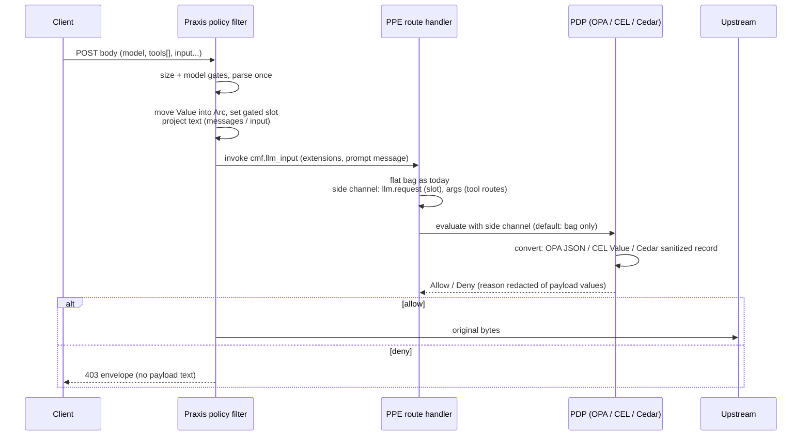

# feat: Authorize LLM request JSON and lists of complex request objects

**Target repos:** PPE (this repo) and Praxis (`../praxis`). Paths prefixed with `praxis:` are
relative to the Praxis repo root. All other paths are relative to this repo.

## Summary

PPE adds four pieces:

- a host-set, capability-gated extension slot for the parsed request document
- a structured side channel on `RoutePayload`, delivered through an additive PDP trait method
- per-engine JSON converters for OPA, CEL, and Cedar
- one redaction rule that keeps payload values out of PDP-generated reasons, errors, and
  diagnostics

Praxis moves its already-parsed body into the slot without cloning it, and projects
Responses and embeddings `input` text into the prompt. The two repos ship as a coordinated PR
pair. The Praxis PR stays in draft on a git dependency until PPE 0.4.0 is released.

---

## Problem Frame

PDPs cannot see `tools[]`, `response_format`, or arrays of objects in MCP arguments. Praxis
never sends the parsed body, and PPE's flattener drops arrays that contain objects. Research
also found that prompt text and PDP error text already reach clients through deny reasons,
which must be fixed for the no-leak acceptance example to hold. (See origin:
`docs/brainstorms/2026-09-28-llm-request-authorization-requirements.md`.)

---

## Requirements

Carried from origin, R1-R17:

- R1. Praxis passes the full parsed body without a second parse or deep copy.
- R2. Existing Praxis gates are unchanged.
- R3. Responses `input` text is projected into the prompt.
- R4. The upstream body is unchanged on allow, and a denied request never reaches upstream.
- R5. The new host-set slot is separate from `llm` and `custom`.
- R6. Built-in PDPs always read the slot. Other plugins read it only with a declared, enforced
  capability.
- R7. Structured MCP args come from the first ToolCall and are gated the same way.
- R8. A side channel sits next to the bag. Structured `args` replaces flattened `args.*` in
  PDP input only.
- R9. OPA and CEL receive native JSON, lists, and maps, and existing names keep their meaning
  (narrowed for `args` by R9a).
- R10. Cedar receives records and sets, and the ordering limitation is documented.
- R11. JSON types survive intact for OPA and CEL.
- R12. The bag, APL, and existing policies are unchanged (except OPA/CEL `args` shape, R9a).
- R13. Absent input stays absent, and engine semantics make dependent policies deny.
- R14. Structured values are redacted from diagnostics, keeping names and types.
- R15. Audit, error, and log output never contain prompt text or request JSON.
- R16. Docs cover the input names, null behavior, qualifying requests, limits, ordering, the
  capability, the Cedar limits, and the SSRF example.
- R17. Delivery is a coordinated PR pair, with the Praxis PR on a git dependency until release.

Plan-time refinements, confirmed during planning:

- R13a. A Cedar step whose document was withheld (reserved-key objects present) denies outright
  with its own violation code. `translate()` already turns evaluation errors into deny, but
  Cedar reads single-key `__entity`/`__extn` objects as entity or extension escapes *without*
  raising an error, so a client could silently change what a rule means.
- R6a. The read capability gates plugins, not PDP resolvers. A PDP resolver is host-supplied,
  in-process code that already receives the whole bag, and implementing the new structured
  method is its opt-in. This narrows R6/R7 for resolvers, and the docs state it.
- R9a. Full replace of `args` in PDP input is a **breaking change** in 0.4.0 for OPA/CEL
  policies on `tool:` routes. Scalar arrays arrive as native, ordered arrays that keep
  duplicates and numbers, not sorted, deduplicated sets of strings. Explicit `null` arrives as
  `null`, not absent. APL and Cedar `${args.X}` template substitution are unchanged. The
  CHANGELOG and docs list the affected patterns with migrations.
- R14a. Payload-origin namespaces (`args`, `result`, `llm.request`) and prompt text are
  redacted in every PDP-generated reason, error, and diagnostic. Engine error text becomes a
  fixed category plus the referenced path. Diagnostics name only the paths the policy
  references, never client-supplied keys. Identity and meta values, and author-written reasons,
  pass through.
- R8a. Structured `args` is built only on `tool:` routes, from the same pre-args-pipeline
  snapshot the bag uses, so PDPs keep seeing arguments as they were before any pipeline
  rewrite. On `llm:` routes, `args` stays the prompt string and is redacted. `prompt:` routes
  are left out for now. `prompts/get` arguments are string maps with no arrays of objects, so
  there is nothing structured to gain.
- R3a. Projection is text only: a string `input`, a string `content` on items, and parts of
  type `input_text`, `text`, or `output_text`. Token-ID arrays, images, and function outputs are
  skipped. Embeddings string `input` is projected too, which is an intended behavior change.

**Origin actors:** A1 (policy author), A2 (Praxis filter), A3 (PPE route handler),
A4 (third-party plugin)
**Origin flows:** F1 (inference authorization), F2 (MCP `tools/call` authorization)
**Origin acceptance examples:** AE1-AE8

---

## Scope Boundaries

- APL quantifiers, list indexing, and item paths.
- Inference body rewriting.
- Enforcing capabilities on the `llm` and `custom` slots.
- A dedicated CMF model for `tools` or `mcp_servers`.
- Structured args from more than the first ToolCall.
- Structured `result` for post-invocation policy.
- Caching converted documents across PDP steps.
- Consuming `PdpDecision.diagnostics` in audit, which nothing reads today.

### Deferred to Follow-Up Work

- APL quantifiers (`any`/`all`) over lists: a new PPE issue, linked from #142.
- Audit-logger reference plugin: it logs the first ToolCall arguments in full
  (`reference/plugins/audit-logger/src/logger.rs`). File a follow-up issue to add value
  redaction to the example.
- A CI guard in Praxis that rejects `allow-git` entries: a separate Praxis issue. A PR
  checklist covers it for now.

---

## Context & Research

### Relevant Code and Patterns

**Extension slots**
- `crates/ppe-core/src/extensions/container.rs` lists every slot in these places: the struct,
  `Clone`, `cow_copy`, `validate_immutable`, and `OwnedExtensions`. `merge_owned` never assigns
  immutable slots.
- `#[serde(skip)]` precedent: raw-credential fields in the same file.
- `crates/ppe-core/src/extensions/filter.rs`: `SlotName`, `slot_policy`, `filter_extensions`,
  `has_read_access`. `Agent` (Immutable, `ReadAgent`) is the closest template.
- `crates/ppe-core/src/extensions/tiers.rs`: the `Capability` enum, serialized in snake_case.
- `crates/ppe-apl-cmf/src/constants.rs` and `capability_namespaces.rs`: the operator-facing
  capability table.

**Route handler and PDP dispatch**
- `crates/ppe-apl-runtime/src/visitor.rs`: capabilities of the synthetic route handler
  (`default_base_capabilities`, plus the `read_headers` grant). The new read capability is
  granted next to `read_headers`.
- `crates/ppe-apl-runtime/src/route_handler.rs`: bag construction, `args_value`,
  `evaluate_pre`/`evaluate_post`.
- `crates/ppe-apl-runtime/src/message_projection.rs`: `extract_args_from_message`.
- `crates/ppe-apl-core/src/route.rs`: `RoutePayload`, passed `&mut` down to `Effect::Pdp`.
- `crates/ppe-apl-core/src/step.rs`: the `PdpResolver` trait `evaluate(call, bag)`.
- `crates/ppe-apl-runtime/src/pdp_router.rs`: `PdpRouter`.
- `crates/ppe-apl-core/src/evaluator.rs`: `evaluate_pdp_contained` and the `Effect::Pdp`
  dispatch. The deny reason propagates from here.

**OPA** (regorus 0.12)
- `crates/builtins/src/pdps/opa/input.rs`: `bag_to_input`.
- `crates/builtins/src/pdps/opa/decision.rs`: decision shapes, the 16×1024 diagnostics cap,
  and degenerate-result rendering.
- `crates/builtins/src/pdps/opa/resolver.rs`: `set_input_json` and `OPA eval error: {e}`.

**CEL** (cel 0.14.5, `json` feature off)
- `crates/builtins/src/pdps/cel/activation.rs`: `yaml_to_value` is the template for a
  hand-written `json_to_value` that keeps integers as `Int`.
- `crates/builtins/src/pdps/cel/resolver.rs`:
  - `on_error` defaults to Deny.
  - `snapshot_referenced_bag_values` prints `key={value:?}`.
  - `must return bool, got {other:?}` and `CEL eval error: {e}` also embed values.
  - `ExecutionError` variants carry values through Debug.

**Cedar** (cedar-policy 4.13)
- `crates/builtins/src/pdps/cedar_direct/request.rs`: context today is delegation, meta,
  security, and authenticated. The operator's `context:` is shallow-merged on top.
- `crates/builtins/src/pdps/cedar_direct/entities.rs`: precedent for turning floats into
  strings.
- `crates/builtins/src/pdps/cedar_direct/decision.rs`: `translate` maps errors to deny.
- Cedar's JSON parser rejects `null` and floats, and reads single-key `__entity`/`__extn`
  objects as escapes.

**Tests**
- `crates/builtins/tests/{opa,cel,cedar}/main.rs` with `visitor_*_config.rs`: end-to-end
  through the visitor with real engines. They are `[[test]]` with `required-features`.
- `crates/ppe-apl-runtime/tests/capability_gating.rs`.
- `crates/ppe-pdp-diff/src/{cases,drivers}.rs`.
- `crates/ppe/tests/docs_examples/main.rs`: tests the doc examples.

**Praxis (`praxis:`)**
- `praxis:crates/filter/src/builtins/http/security/policy/llm.rs`:
  - `ParsedLlmRequest(Value)`. After the invoke, only `is_streaming()` is used, so it can be
    moved.
  - `content()` and `push_text` build the projection.
  - `as_value()` is `#[cfg(test)]`. Replace it rather than adding a second accessor, because
    `dead_code` is denied.
- `praxis:crates/filter/src/builtins/http/security/policy/filter.rs`: `dispatch_llm_request`
  and `attach_llm_attributes` (set the slot there). Response-phase warn logs print
  `violation = ?…`.
- `praxis:crates/filter/src/builtins/http/security/policy/tests.rs`: the
  `dispatch_inference_as` harness, `write_llm_*_config`, and `write_cel_policy_config`.
- `praxis:tests/integration/tests/suite/examples/policy_llm.rs`, `start_echo_backend()`, and
  `start_stateful_backend`.
- `praxis:Cargo.toml` pins `ppe = 0.3.1`. `praxis:deny.toml` has `allow-git = []` and
  `unknown-git = "deny"`.

### Institutional Learnings

- Capabilities gate reads by slot path. Keep security exclusions fixed in code, not in an
  operator-maintained list (`docs/brainstorms/2026-08-23-upstream-header-projection-requirements.md`).
- Heavy engines stay optional per feature. New tests go into the existing per-engine
  `main.rs` harnesses, not new top-level `tests/*.rs` files, because each new binary costs
  about 87s under endpoint security
  (`docs/plans/2026-09-25-001-refactor-consolidate-builtins-crate-plan.md`).
- PDP errors must deny (`docs/proposals/00002_cedar-fail-closed-override.md`). The entity
  builder's empty-defaults pattern is deliberately *not* applied to the new document, because
  R13 requires absence.
- `serde_json` `preserve_order` is on across the workspace. Sort explicitly anywhere stable
  bytes are asserted.
- Redaction must happen in the formatter itself. A later transform can fail open
  (`docs/dev/safety-invariants.md`).

---

## Key Technical Decisions

- **The slot holds `Arc<serde_json::Value>`, is immutable, and is `#[serde(skip)]`.** The host
  shares it without a copy, plugins cannot swap it, and it never appears in serialized
  extension dumps or session stores. Resume after an elicitation pause is a fresh request from
  the agent SDK, so Praxis re-attaches the slot every time.
- **Gating uses a new `Capability` variant, granted to the synthetic APL route handler.** The
  executor filters the route handler like any other plugin, so the grant is what lets the
  built-in PDPs see the slot. Base capabilities can be replaced by hosts, so the grant is made
  explicitly in the visitor rather than through them.
- **The side channel lives on `RoutePayload`, with an additive default method on `PdpResolver`.** The
  default falls back to `evaluate(call, bag)`, so the router, test fakes, pdp-diff drivers, and
  benches keep compiling. Only PDPs that override the method receive structured input. They
  are in-process Rust, so overriding it is the opt-in, and no router-side capability check is
  added (R6a). The side channel holds `Arc<serde_json::Value>` for both entries, sharing the
  slot's `Arc`, so the spawn in `evaluate_pdp_contained` and parallel-branch payload clones
  only bump reference counts. The type is `serde_json`-based, because `ppe-apl-core` does not
  depend on `ppe-core`.
- **Structured `args` comes from the route handler's pre-pipeline snapshot.** That is the same
  `args_value` the bag is flattened from, so the route handler sets it on `RoutePayload`
  before `evaluate_pre`, and the evaluator never needs to know the route kind. It is
  populated only on `tool:` routes, so historical tool calls in an LLM message cannot fill it.
  This keeps today's rule that PDPs see arguments as they were before the pipeline.
- **Merge order in PDP input: structured names fully replace flattened keys under the same
  top-level segment (breaking, R9a).** `args` from the side channel replaces every flattened
  `args.*` key. There is one representation that matches the JSON, so a field's type never
  depends on what the client sent. `llm.request` is added beside
  `llm.model_id`/`llm.provider`/`llm.capabilities`, which remain. The overlay-only-dropped-paths
  alternative was rejected: a client could flip a field from a set of strings to a native array
  by adding one object, and so get past deny-lists.
- **CEL gets a hand-written converter.** It keeps integers as `Int`, matching the existing YAML
  converter and avoiding the `UInt` split that `cel::to_value` introduces.
- **Cedar sanitizing:**
  - Nulls are dropped.
  - Floats become strings.
  - Any object containing an `__entity` or `__extn` key withholds the whole document.
  - A withheld document makes the Cedar step deny with a dedicated code (R13a).
  - `llm` and `args` become reserved keys in the operator's `context:`. A clash is rejected at
    config load by a new default no-op `validate_call` method on `PdpResolver`. The visitor
    calls it for every compiled PDP step, and the Cedar resolver implements it. No load-time
    hook for validating PDP calls exists today; the factory only sees `global.pdp[]`.
  - Cedar `contains` over record sets needs an exact match on the whole record, so a
    "deny if any tool is named X" rule can be evaded by adding a field. Docs state that Cedar
    must not be used for deny-lists over `llm.request.tools`; use OPA or CEL instead.
- **Redaction lives in one shared helper in `ppe-apl-core`.** It holds the payload namespace
  list and formats a value as its type name. The CEL, OPA, and Cedar formatters all call it.
  Engine error text is mapped to a fixed category plus the referenced path, never passed
  through verbatim.
- **Release:** PPE bumps to 0.4.0, because the `PdpResolver` trait and `RoutePayload` gain
  members, deny-reason text changes, and `args` in OPA/CEL input changes shape (R9a). The Praxis draft PR adds the PPE repo URL to `allow-git`
  temporarily. The PR checklist requires removing it and switching to the registry version
  before merge.

---

## Open Questions

### Resolved During Planning

- **Do the built-in PDPs see a gated slot?** Only if the route handler is granted the
  capability, so the plan grants it in the visitor.
- **Does pause/resume lose the document?** No. Resume is a fresh request, and the host attaches
  the slot every time.
- **Do Cedar errors deny?** Yes: `translate` maps errors to deny. The remaining gap is
  reserved-key escapes, which raise no error, and R13a handles that.
- **Default CEL `on_error`?** Deny. A missing key is `NoSuchKey`, which denies.
- **OPA undefined result?** It denies for boolean and object queries. Deny-set queries over
  absent input yield an empty set, so the docs state the safe idiom per decision shape and
  tests pin each shape.
- **Can Praxis avoid a clone?** Yes. Inside `dispatch_llm_request`, `parsed` is still
  borrowed by `attach_llm_attributes` (promoted params), `request_message` (prompt
  projection), and later `is_streaming()`. All three are computed before the move. The caller
  in `on_request_body` matches `parsed` by value instead of through `as_ref()`.

### Deferred to Implementation

- Exact names for the slot, capability, side-channel type, and trait method. Pick names that
  match nearby naming.
- The fixed category set for engine errors: derive it from the actual `ExecutionError`,
  regorus, and Cedar error variants met in tests.
- Whether OPA input uses `set_input(Value)` directly or keeps JSON serialization. Measure both
  before choosing.
- Whether `validate_immutable` needs an explicit pointer check for the new slot, or whether the
  generic `Arc` pattern already covers it.

---

## High-Level Technical Design

> *This illustrates the intended approach and is directional guidance for review, not
> implementation specification. The implementing agent should treat it as context, not code
> to reproduce.*

Per-engine view of the same input:

| JSON | OPA | CEL | Cedar |
|---|---|---|---|
| object | object | map | record |
| array (ordered, duplicates) | array, preserved | list, preserved | set: unordered, deduplicated |
| integer | number | Int | Long |
| float `0.7` | number | Double | string `"0.7"` |
| `null` | null | null | attribute absent |
| `{"__entity":…}` anywhere | plain object | plain map | document withheld, so the step denies |
| document absent | `input.llm.request` undefined | `NoSuchKey`, so the step denies | missing attribute, so the step denies |

---

## Implementation Units

### Phase A: PPE

- U1. **Gated request-document slot**

**Goal:** Add a host-set, immutable, non-serialized slot for the parsed request, readable only
with a new capability, and grant that capability to APL's synthetic route handler.

**Requirements:** R5, R6, R12; A2, A4; AE7

**Dependencies:** None

**Files:**
- Modify: `crates/ppe-core/src/extensions/container.rs`
- Modify: `crates/ppe-core/src/extensions/filter.rs`
- Modify: `crates/ppe-core/src/extensions/tiers.rs`
- Modify: `crates/ppe-core/src/extensions/mod.rs`
- Modify: `crates/ppe-apl-cmf/src/constants.rs`
- Modify: `crates/ppe-apl-cmf/src/capability_namespaces.rs`
- Modify: `crates/ppe-apl-runtime/src/visitor.rs`
- Test: inline tests in `crates/ppe-core/src/extensions/filter.rs` and `container.rs`
- Test: `crates/ppe-apl-runtime/tests/capability_gating.rs`

**Approach:**
- Mirror the `Agent` slot: Immutable, `CapabilityGated`, and a new capability variant.
- Whole-field `#[serde(skip)]`.
- Do not touch `extensions_bridge.rs`, so the document is never flattened into the bag.
- Grant the capability to the synthetic route handler next to the existing `read_headers`
  grant.

**Patterns to follow:** `Agent` / `ReadAgent`, and the raw-credential `#[serde(skip)]` fields.

**Test scenarios:**
- Happy path: a plugin that declares the capability sees the slot's `Arc`, and it is the same
  pointer as the host's.
- Covers AE7. Error path: a plugin without the capability sees the slot as `None`.
- Error path: a plugin that returns owned extensions with the slot set or changed fails
  `validate_immutable`, or is ignored by `merge_owned`. The host value survives.
- Edge case: serializing `Extensions` with the slot set produces no field for it.
- Integration: an APL route's synthetic handler gets the slot through the executor filter,
  even when the host replaced the base capabilities.

**Verification:** the capability-gating tests pass, and no existing slot test changes.

---

- U2. **Structured side channel to PDPs**

**Goal:** Carry `llm.request` and structured `args` from the route handler to PDPs without
changing the bag or the existing `evaluate` contract.

**Requirements:** R6a, R7, R8, R8a, R12, R13; F1, F2

**Dependencies:** U1

**Files:**
- Modify: `crates/ppe-apl-core/src/route.rs`
- Modify: `crates/ppe-apl-core/src/step.rs`
- Modify: `crates/ppe-apl-runtime/src/pdp_router.rs`
- Modify: `crates/ppe-apl-core/src/evaluator.rs`
- Modify: `crates/ppe-apl-runtime/src/route_handler.rs`
- Test: inline tests in `crates/ppe-apl-core/src/evaluator.rs` and `route.rs`
- Test: `crates/ppe-apl-runtime/tests/cmf_invoker_dispatch.rs`

**Approach:**
- `RoutePayload` gains an optional structured-input field holding `Arc<serde_json::Value>`
  entries.
- The route handler fills `llm.request` from the filtered view of the slot, sharing its `Arc`.
  It fills `args` from the same pre-pipeline `args_value` the bag is flattened from, on
  `tool:` routes only, before calling `evaluate_pre`.
- `evaluate_pdp_contained` passes the field to a new `PdpResolver` default method.
- `PdpRouter` forwards to the resolved PDP's method.
- An absent document stays `None` and is never defaulted to an empty object.

**Patterns to follow:** the existing `Arc` + spawn cloning in `evaluate_pdp_contained`.

**Test scenarios:**
- Happy path: on a `tool:` route whose first ToolCall has `{"items":[{…},{"classification":"secret"}]}`,
  a fake PDP that overrides the new method receives `args.items` as a two-element array.
- Happy path: on an `llm:` route with the slot set, the fake PDP receives `llm.request` equal
  to the host document.
- Edge case: on an `llm:` route with no slot, the side channel has no `llm.request` (absent,
  not `{}`).
- Edge case: on an `llm:` route whose message contains a ToolCall part, structured `args` is
  absent.
- Edge case: when an args pipeline step rewrites an argument, the PDP still sees the original
  pre-pipeline value, matching the bag.
- Edge case: a parallel dispatch shares the same `Arc` document across branches, with no deep
  copy.
- Integration: a PDP that does not override the method still receives only the bag, and every
  existing evaluator and router test passes unmodified.

**Verification:** `make check` is green across both feature sets, and existing
`ppe-apl-core`/`ppe-apl-runtime` tests are unchanged.

---

- U3. **Shared payload-value redaction**

**Goal:** Build one helper that decides whether a path belongs to a payload namespace and
formats values as type names only. It is the single authority the engines call.

**Requirements:** R14, R14a, R15; AE6

**Dependencies:** None. It must land in the same commit as U4, its first caller, because
`dead_code` is denied and a scoped allow for future callers is not permitted.

**Files:**
- Create: `crates/ppe-apl-core/src/redact.rs`
- Modify: `crates/ppe-apl-core/src/lib.rs`
- Test: inline tests in `crates/ppe-apl-core/src/redact.rs`

**Approach:**
- The payload namespaces (`args`, `result`, `llm.request`) are a fixed list in code, not
  config.
- Formatting a JSON or bag value produces a type label such as `list(2)`, `map`, `string`, or
  `int`. It never produces the contents or client-supplied child keys.

**Test scenarios:**
- Happy path: `args.items` is a payload path, while `subject.role` and `meta.entity_name` are
  not.
- Happy path: formatting `{"secret":"x"}` yields `map`, and the key name `secret` does not
  appear.
- Edge case: `llm.model_id` is not a payload path, but `llm.request.tools` is.

**Verification:** `make lint` is green in the U3+U4 commit. U5 and U6 add the remaining
callers.

---

- U4. **OPA structured input and redaction**

**Goal:** Merge the side channel into OPA input as native JSON, and remove payload values from
OPA-generated reasons.

**Requirements:** R9, R9a, R11, R13, R14a; AE1, AE5, AE6, AE8

**Dependencies:** U2, U3

**Files:**
- Modify: `crates/builtins/src/pdps/opa/input.rs`
- Modify: `crates/builtins/src/pdps/opa/resolver.rs`
- Modify: `crates/builtins/src/pdps/opa/decision.rs`
- Test: inline tests in `crates/builtins/src/pdps/opa/input.rs` and `decision.rs`
- Test: `crates/builtins/tests/opa/main.rs` and its visitor config test module

**Approach:**
- Build the flat-bag tree as today, then overlay the structured names. Structured `args`
  replaces the whole `args` subtree.
- Degenerate-result rendering and `OPA eval error` text go through U3. An author-written
  deny-object `reason` passes through unchanged.

**Test scenarios:**
- Covers AE1. Integration: with the rule "deny if any `tools[i].function.name ==
  "transfer_funds"`", a request whose second tool matches is denied and a permitted-only
  request is allowed.
- Covers AE8. Happy path: `[]`, `{}`, `null`, `[1,1]`, mixed arrays, and nested arrays of
  objects round-trip with order and types intact.
- Edge case: flattened `args.region` is gone from `input.args`, and structured
  `input.args.region` is present and equal.
- Edge case (R9a, pinning the breaking change): `ids: [2,1,1]` arrives as numbers in client
  order with the duplicate kept, so `"1" in input.args.ids` no longer matches and
  `1 in input.args.ids` does. `note: null` arrives as `null`, so `not input.args.note` is
  false.
- Covers AE5. Error path: with the document absent, each decision shape (boolean allow, deny
  object, deny set) behaves as documented. Boolean and object shapes deny.
- Covers AE6. Error path: a query that returns `input.llm.request` as a degenerate result
  produces a reason without the marker string. A policy runtime error on a payload value
  produces a fixed-category reason.

**Verification:** all existing OPA tests pass, and the new harness cases run under the `opa`
feature.

---

- U5. **CEL structured variables and redaction**

**Goal:** Expose `llm.request` and `args` as native CEL lists and maps, and redact CEL
diagnostics and reasons.

**Requirements:** R9, R9a, R11, R13, R14, R14a; AE1, AE2, AE4, AE5, AE6, AE8

**Dependencies:** U2, U3

**Files:**
- Modify: `crates/builtins/src/pdps/cel/activation.rs`
- Modify: `crates/builtins/src/pdps/cel/resolver.rs`
- Test: inline tests in `crates/builtins/src/pdps/cel/activation.rs` and `resolver.rs`
- Test: `crates/builtins/tests/cel/main.rs`, `crates/builtins/tests/cel/visitor_cel_config.rs`

**Approach:**
- Add a JSON-to-CEL converter modelled on `yaml_to_value`, keeping integers as `Int`.
- Structured names override bag-derived variables for `args`. `llm.request` is merged into the
  existing `llm` map.
- `snapshot_referenced_bag_values` emits only referenced paths, with payload values rendered
  through U3.
- The `got {other:?}` reason and `CEL eval error: {e}` map payload-bearing errors to a fixed
  category plus the path.

**Test scenarios:**
- Covers AE1. Integration: `!llm.request.tools.exists(t, has(t.function) && t.function.name ==
  "transfer_funds")` denies when the second tool matches and allows otherwise.
- Covers AE2. Integration: the SSRF allowlist `llm.request.tools.all(t, allowed.exists(p,
  t.type.matches(p)))` denies `web_search_20250305` when it is not allowlisted, and allows it
  when it is.
- Covers AE4. Integration: on a `tool:` route, `args.items.exists(i, has(i.classification) &&
  i.classification == "secret")` denies when the second item matches. An APL
  `args.region == "eu"` predicate on the same route still evaluates.
- Covers AE5. Error path: referencing `llm.request.tools` with no document denies under the
  default `on_error`. When `tools` is absent from a supplied document, the rule guards with
  `has()` and the step allows.
- Covers AE8. Happy path: `[1,1]` is a two-element list, `null` is CEL null, `{}` is an empty
  map, and `1` is `Int`.
- Edge case (R9a, pinning the breaking change): `13 in args.ids` matches `[13]` while
  `"13" in args.ids` does not. `has(args.note)` is true for an explicit `null`.
- Covers AE6. Error path: a false result, a non-bool result, and a type-mismatch error over a
  prompt marker produce reasons and diagnostics without the marker or any child key names.

**Verification:** all existing CEL tests pass, including the existing `on_error` tests.

---

- U6. **Cedar sanitized context and withheld-document deny**

**Goal:** Map the side channel into Cedar context safely, and deny outright when the document
cannot be represented safely.

**Requirements:** R10, R13, R13a, R14a; AE5, AE6

**Dependencies:** U2, U3

**Files:**
- Modify: `crates/builtins/src/pdps/cedar_direct/request.rs`
- Modify: `crates/builtins/src/pdps/cedar_direct/resolver.rs`
- Modify: `crates/builtins/src/pdps/cedar_direct/decision.rs`
- Modify: `crates/ppe-apl-core/src/step.rs` (default no-op `validate_call` on `PdpResolver`)
- Modify: `crates/ppe-apl-runtime/src/pdp_router.rs` (forward `validate_call`)
- Modify: `crates/ppe-apl-runtime/src/visitor.rs` (call `validate_call` for each compiled PDP
  step at load)
- Test: inline tests in `crates/builtins/src/pdps/cedar_direct/request.rs`
- Test: `crates/builtins/tests/cedar/main.rs` and its visitor config module

**Approach:**
- Walk the JSON once:
  - drop nulls
  - turn floats and out-of-range integers into strings
  - on any object with an `__entity`/`__extn` key, return "withheld"
- A withheld document means the step returns Deny with a dedicated code, before Cedar
  evaluates.
- Cedar error text on payload paths is redacted through U3. That includes the context
  construction error that the evaluator wraps as `PDP error: …`.
- The Cedar resolver implements `validate_call` and rejects `context.llm` and `context.args`.

**Patterns to follow:** float-to-string conversion in `entities.rs`, and error-to-deny in
`decision.rs`.

**Test scenarios:**
- Happy path: `context.llm.request.tools.contains({"type":"function"})`-style permit and
  forbid rules evaluate over a sanitized record.
- Edge case (documented limitation): the same `contains` does not match a tool that has an
  extra field. The test pins this so the docs warning stays true.
- Error path: a body containing `{"__entity":{"type":"User","id":"admin"}}` nested in `tools`
  denies with the withheld code, even though the only relevant rule is a `forbid` with
  `has`.
- Covers AE5. Edge case: a `null` field is absent, so `has` is false and the documented
  behavior holds. A float `0.7` becomes `"0.7"`.
- Error path: an operator `context:` defining `llm` or `args` is rejected at config load.
- Covers AE6. Error path: a type error on a payload attribute produces a reason without the
  value.

**Verification:** all existing Cedar tests pass.

---

- U7. **Cross-engine consistency and end-to-end leak tests**

**Goal:** Prove that equivalent OPA, CEL, and Cedar policies agree on structured inputs within
the documented limits, and that no deny path leaks payload text.

**Requirements:** R9-R15; AE6, AE8

**Dependencies:** U4, U5, U6

**Files:**
- Modify: `crates/ppe-pdp-diff/src/cases.rs`
- Modify: `crates/ppe-pdp-diff/src/drivers.rs`
- Modify: `crates/ppe-pdp-diff/src/allowlist.rs`
- Test: the existing ppe-pdp-diff test harness

**Approach:**
- Drivers call the new PDP method with a side channel.
- Cases cover forbidden-tool-second, empty `tools`, `null` and float fields, and duplicates.
- Cedar is excluded from the forbidden-tool agreement cases, because it cannot express
  "any tool with field X". Those cases and the known Cedar divergences (duplicates, nulls) go
  on the allowlist, with a reason pointing to the docs table.

**Test scenarios:**
- Integration: OPA and CEL agree on allow or deny for the forbidden-second-tool and
  permitted-only cases. Cedar is allowlisted for these.
- Integration: divergence on duplicate-count policies is allowlisted and documented, never
  silent.
- Covers AE6. Integration: for each engine, a denied request carrying a unique marker in
  `messages` and `tools` yields a violation reason and diagnostics with no marker.

**Verification:** the pdp-diff suite passes, and the allowlist entries reference the docs.

---

- U8. **PPE docs, changelog, and 0.4.0**

**Goal:** Document the feature and prepare the release.

**Requirements:** R6a, R9a, R16, R17

**Dependencies:** U1-U7

**Files:**
- Modify: `docs/content/apl/pdp.md`
- Modify: `docs/content/extensions.md`
- Modify: `docs/content/cmf-extensions.md`
- Modify: `docs/content/apl/attributes.md`
- Modify: `CHANGELOG.md`
- Modify: `Cargo.toml` (workspace version and internal pins)
- Test: `crates/ppe/tests/docs_examples/main.rs` (doc examples compile and evaluate)

**Approach:**
- Document the names (`llm.request`, structured `args`), including that `llm.request` is the
  pre-plugin original body.
- Document absent versus null behavior, and the safe idiom per engine and per OPA decision
  shape.
- Include:
  - the cross-engine type table
  - the capability name, and that it gates plugins, not PDP resolvers (R6a)
  - the Cedar withheld-document code
  - the Cedar exact-match warning (do not use Cedar for deny-lists over `tools`)
  - the SSRF allowlist example in OPA and CEL
- Add an `args` migration section (R9a) with before/after examples for:
  - number or bool arrays that used to be compared as strings
  - reliance on sorted order
  - reliance on deduplication
  - explicit `null`
- CHANGELOG:
  - an Added entry for the feature
  - a **breaking** Changed entry for the `args` shape in OPA/CEL input, linking the migration
    section
  - a Changed entry for redacted deny reasons
  - a Changed entry for the reserved Cedar `context:` keys

**Test scenarios:**
- Integration: the SSRF OPA and CEL doc examples load through the docs-examples harness and
  deny a non-allowlisted tool type.

**Verification:** `make doc` and the docs-examples tests pass.

### Phase B: Praxis (draft PR)

- U9. **Attach the parsed document without cloning**

**Goal:** Move the parsed body into the new slot at `cmf.llm_input`.

**Requirements:** R1, R2, R4; F1, A2

**Dependencies:** U1 (on a git dependency)

**Files:**
- Modify: `praxis:crates/filter/src/builtins/http/security/policy/llm.rs`
- Modify: `praxis:crates/filter/src/builtins/http/security/policy/filter.rs`
- Modify: `praxis:Cargo.toml` (git dependency)
- Modify: `praxis:deny.toml` (temporary `allow-git`)
- Test: `praxis:crates/filter/src/builtins/http/security/policy/tests.rs`

**Approach:**
- Change the caller in `on_request_body` to match `parsed` by value instead of through
  `as_ref()`, and take `ParsedLlmRequest` by value in `dispatch_llm_request`.
- Before the move, compute the promoted params, `request_message` (prompt projection), and
  `is_streaming()`.
- Replace the test-only `as_value()` with a consuming accessor used in production.
- Set the slot beside the `LLMExtension` in `attach_llm_attributes`.

**Test scenarios:**
- Happy path: a filter unit test with an OPA or CEL policy on `llm.request.tools` denies when
  the forbidden tool is second and allows otherwise.
- Edge case: a streaming request still sets `llm.stream` metadata after the move.
- Error path: an oversized body still returns 413 before PPE is invoked, and an ambiguous
  `jsonrpc`+`model` body is still rejected.

**Verification:** the existing policy filter tests pass. The body is parsed once, confirmed by
reading `on_request_body`.

---

- U10. **Text-only Responses and embeddings projection**

**Goal:** Project the text of `input` into the CMF prompt.

**Requirements:** R3, R3a; AE3

**Dependencies:** None (parallel with U9)

**Files:**
- Modify: `praxis:crates/filter/src/builtins/http/security/policy/llm.rs`
- Test: `praxis:crates/filter/src/builtins/http/security/policy/llm.rs` (inline tests)

**Approach:**
- After `prompt`, handle `input` as either a string, or an array of strings and items.
- For an item, take a string `content`, or the text parts of a `content` array
  (`input_text`/`text`/`output_text`).
- Skip integer arrays, images, and `function_call_output`.

**Test scenarios:**
- Covers AE3. Happy path: a Responses body with `input: [{role, content:[{type:"input_text",
  text:"hi"}]}]` projects `hi`.
- Happy path: `input: "hello"` projects `hello`. This updates the embeddings "no prompt" test
  on purpose.
- Edge case: `input: [[1,2,3]]` token IDs project nothing.
- Edge case: an `input_image` part is skipped, and a `function_call_output` item is skipped.
- Integration: Chat Completions, Anthropic `system`, and legacy `prompt` projections are
  unchanged.

**Verification:** only the intentionally updated embeddings test changes expectation.

---

- U11. **Praxis end-to-end tests and docs**

**Goal:** Prove the full proxy path, including upstream byte-equality and never-forwarded
denies.

**Requirements:** R4, R13, R15, R16; AE1, AE3, AE6

**Dependencies:** U9, U10

**Files:**
- Create: `praxis:tests/integration/fixtures/llm-request-policy.yaml`
- Modify: `praxis:tests/integration/tests/suite/examples/policy_llm.rs`, or add a sibling
  module to the same suite binary
- Modify: `praxis:docs/filters/http/security/policy.md`
- Modify: `praxis:examples/configs/security/policy-llm.yaml`

**Approach:**
- Use `start_echo_backend()` to compare the forwarded body with the sent bytes.
- Use a counting or stateful backend to assert that no upstream hit happens on deny.
- Cover one Chat Completions shape and one Responses shape, with OPA and CEL steps.

**Test scenarios:**
- Covers AE1. Integration: Chat Completions with the forbidden tool second returns 403 and the
  backend count stays 0. A permitted-only request echoes back byte-identical.
- Covers AE3. Integration: a Responses-style `input` request is authorized on `llm.request.input`
  and allowed through unchanged.
- Covers AE6. Integration: a denied request carrying a marker in `messages` gets a 403 body
  and an `X-Policy-Violation` header without the marker. Captured logs contain no marker.
- Error path: an oversized body gets 413 under `llm.max_request_bytes`.

**Verification:** the Praxis suite passes, apart from the known unrelated TLS SNI and TCP
failures. The PR checklist requires switching to the registry `praxis-policy 0.4.0` and
removing the `allow-git` entry before merge.

---

## System-Wide Impact

- **Interaction graph:** the slot passes through the executor extension filter for every
  plugin. Only capability holders, including the APL route handler, see it. The side channel
  reaches only PDPs that override the new method.
- **Error propagation:** conversion failures and withheld documents surface as Deny with value-free
  reasons. They never surface as panics or `on_error: allow` paths that echo data.
- **State lifecycle:** the slot is `#[serde(skip)]`, so it never reaches Valkey or serialized
  dumps. Each request re-attaches it.
- **API surface parity:** `invoke_named`, `invoke`, and `invoke_by_name` all carry the new slot
  through `Extensions`. No host API signature changes.
- **Unchanged invariants:**
  - the flat bag
  - the APL grammar and evaluator
  - `custom.llm.*`, `llm.model_id`, `llm.provider`, and `llm.capabilities`
  - existing scalar and set policies in APL, and every OPA/CEL policy that does not read
    `args`
  - `evaluate(call, bag)` for third-party PDPs
  - PDPs see pre-pipeline `args`, as today
  - Praxis upstream bytes on allow
- **Behavior changes, intentional and in the CHANGELOG:**
  - **Breaking:** OPA/CEL `args` on `tool:` routes is native JSON. Scalar arrays are ordered,
    keep duplicates and numbers, and explicit `null` is present (R9a).
  - Deny reasons generated from CEL, OPA, or Cedar errors no longer echo values.
  - Embeddings string `input` now reaches text plugins.
  - `llm` and `args` are reserved in the Cedar `context:`.

---

## Risks & Dependencies

| Risk | Mitigation |
|------|------------|
| Cedar reads `__entity`/`__extn` escapes silently, changing what a rule means | R13a withheld-document deny, plus a `forbid`+`has` test (U6) |
| Cedar record-set `contains` is exact-match, so a deny-list is easy to evade | Docs warning, a pinned test (U6), and Cedar excluded from the agreement cases (U7) |
| The `args` full replace silently weakens an existing string-compared deny rule | A breaking CHANGELOG entry, a migration section, and pinned tests (U4, U5, U8). Operators audit tool-route OPA/CEL rules before upgrading |
| An OPA deny-set over absent input reads as allow | Documented idioms per decision shape, and tests pinning each shape (U4, U8) |
| Engine libraries embed values in error text | Map errors to a fixed category plus the path through U3, with a marker test per engine (U4-U7) |
| Redaction breaks existing tests that assert on reason text | Update them deliberately and list them under the CHANGELOG Changed entry |
| The `allow-git` entry or git dependency ships in Praxis | The Praxis PR stays draft, and the merge checklist requires the registry version |
| Converting a large body costs time per PDP step | Bounded by `max_request_bytes` and serde's recursion limit. Caching is deferred |
| `preserve_order` makes test assertions depend on the build | Compare parsed values, not serialized bytes, or sort explicitly |
| New test binaries are slow to link under endpoint security | Add cases to the existing per-engine `main.rs` harnesses and suite binaries only |

---

## Documentation / Operational Notes

- The PPE docs and CHANGELOG are covered in U8. The Praxis docs and example config are covered
  in U11.
- Release order:
  1. Merge the PPE PR.
  2. Publish 0.4.0.
  3. Flip the Praxis PR to the registry version, remove `allow-git`, and mark it ready.
- File follow-up issues for APL quantifiers, audit-logger redaction, and the Praxis
  `allow-git` CI guard.

---

## Sources & References

- **Origin document:** [docs/brainstorms/2026-09-28-llm-request-authorization-requirements.md](../brainstorms/2026-09-28-llm-request-authorization-requirements.md)
- Issue: https://github.com/praxis-proxy/policy/issues/142
- Background: `.sketchpad/limitations_response.md`, `.sketchpad/llm_authorization.md`
- Related: `docs/proposals/00002_cedar-fail-closed-override.md`,
  `docs/dev/safety-invariants.md`
